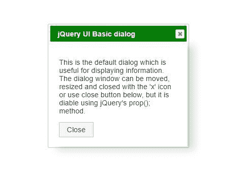
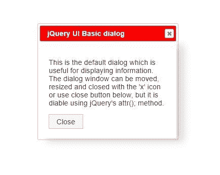

# 如何从函数中禁用 jQuery 对话框中的一个按钮？

> 原文:[https://www . geesforgeks . org/如何禁用 jquery 中的按钮-对话框-来自函数/](https://www.geeksforgeeks.org/how-to-disable-a-button-in-jquery-dialog-from-a-function/)

基本对话窗口是位于视口内的一个覆盖层，并且受到 jQuery 用户界面的页面内容的保护。根据以下方法，在使用 jQuery 的函数中禁用 jQuery 对话框中的按钮。

**方法 1:**

*   在用户界面对话框中，按钮作为默认类被称为用户界面按钮，所以关注它。
*   创建一个函数，该函数将在页面加载时触发 ready 中的对话框。
*   然后使用 jQuery 方法参数(' disabled '，true)用类 ui-button 禁用该按钮。

**语法:**

```html
$(selector).dialog();
$(selector).prop('disabled', true);
```

**示例:**下面的示例说明了如何借助 prop()方法从函数中禁用 jQuery 对话框中的按钮。

## 超文本标记语言

```html
<!DOCTYPE html>
<html lang="en">

<head>
    <meta charset="utf-8">
    <meta name="viewport"
        content="width=device-width, initial-scale=1">

    <link rel="stylesheet" href=
"//code.jquery.com/ui/1.12.1/themes/base/jquery-ui.css">

    <link rel="stylesheet" href=
"https://code.jquery.com/ui/1.12.1/themes/base/jquery-ui.css">

    <script src=
        "https://code.jquery.com/jquery-1.12.4.js">
    </script>

    <script src=
        "https://code.jquery.com/ui/1.12.1/jquery-ui.js">
    </script>

    <style>
        .ui-widget-header {
            background: green;
            color: #ffffff;
        }

        #dialog {
            box-shadow: 1rem .5rem 1rem
                rgba(0, 0, 0, .15) !important;

            padding: 20px;
        }
    </style>
</head>

<body>
    <div id="dialog" title="jQuery UI Basic dialog">

<p>
            This is the default dialog which is useful
            for displaying information. The dialog
            window can be moved, resized and closed
            with the 'x' icon or use close button below,
            but it is disable using jQuery's prop();
            method.
        </p>

        <button type="button" class=
            "ui-button ui-widget" title="Close">
            Close
        </button>
    </div>

    <script>
        $(function() {

            // Trigger dialog box
            $("#dialog").dialog();

            // attr() method applied here
            $(".ui-button").prop('disabled', true);
        });
    </script>
</body>

</html>
```

**输出:**



**方法 2:**

*   在用户界面对话框中，按钮作为默认类被称为用户界面按钮，所以关注它。
*   创建一个函数，该函数将在页面加载时触发 ready 中的对话框。
*   然后使用 jQuery 方法 attr('disabled '，true)用类 ui-button 禁用该按钮。

**语法:**

```html
$(selector).dialog();
$(selector).attr('disabled', true);
```

**示例:**下面的示例说明了如何借助 attr()方法从函数中禁用 jQuery 对话框中的按钮。

## 超文本标记语言

```html
<!DOCTYPE html>
<html lang="en">

<head>
    <meta charset="utf-8">

    <meta name="viewport"
        content="width=device-width, initial-scale=1">

    <link rel="stylesheet" href=
"https://code.jquery.com/ui/1.12.1/themes/base/jquery-ui.css">

    <script src="
        https://code.jquery.com/jquery-1.12.4.js">
    </script>

    <script src=
        "https://code.jquery.com/ui/1.12.1/jquery-ui.js">
    </script>

    <style>
        .ui-widget-header {
            background: red;
            color: #ffffff;
        }

        #dialog {
            box-shadow: 1rem .5rem 1rem rgba(
            0, 0, 0, .15)!important;
            padding: 20px;
        }
    </style>
</head>

<body>
    <div id="dialog"
        title="jQuery UI Basic dialog">

<p>
            This is the default dialog which is
            useful for displaying information.
            The dialog window can be moved,
            resized and closed with the 'x'
            icon or use close button below,
            but it is disable using jQuery's
            attr(); method.
        </p>

        <button type="button" class=
            "ui-button ui-widget" title="Close">
            Close
        </button>
    </div>

    <script>
        $(function() {

            // Trigger dialog box
            $("#dialog").dialog();

            // attr() method applied here
            $(".ui-button").attr('disabled', true);
        });
    </script>
</body>

</html>
```

**输出:**



**参考:**T2】https://www.geeksforgeeks.org/jqueryui-dialog/

jQuery 是一个开源的 JavaScript 库，它简化了 HTML/CSS 文档之间的交互，它以其“少写多做”的理念而闻名。
跟随本 [jQuery 教程](https://www.geeksforgeeks.org/jquery-tutorials/)和 [jQuery 示例](https://www.geeksforgeeks.org/jquery-examples/)可以从头开始学习 jQuery。