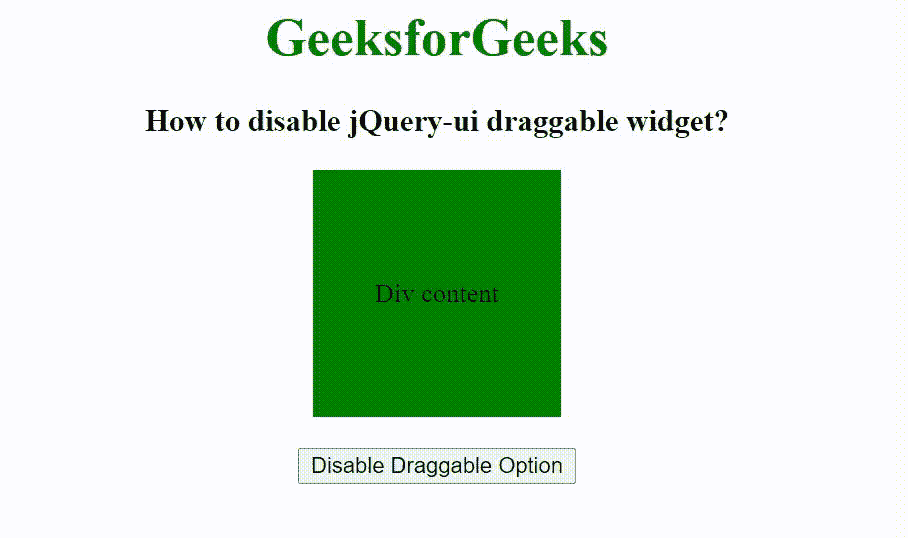

# 如何禁用小部件的 jQuery-ui 可拖动性？

> 原文:[https://www . geeksforgeeks . org/how-disable-a-jquery-ui-draggable-of-widget/](https://www.geeksforgeeks.org/how-to-disable-a-jquery-ui-draggable-of-widget/)

在本文中，我们将看到如何使用 jQuery-ui 禁用可拖动的小部件。jQuery 用户界面由图形用户界面小部件、视觉效果和使用 HTML、CSS 和 jQuery 实现的主题组成。jQuery 用户界面非常适合为网页构建用户界面。如果可拖动元素的值设置为真，则 [jQuery UI 可拖动禁用选项](https://www.geeksforgeeks.org/jquery-ui-draggable-disabled-option/)用于禁用可拖动元素。

**语法:**

```html
$( ".selector" ).draggable({
   disabled: true/false
});
```

**CDN 链接:**首先，添加项目所需的 jQuery UI 脚本。

> <link rel="”stylesheet”" href="”//code.jquery.com/ui/1.12.1/themes/smoothness/jquery-ui.css”">
> <脚本 src =//code . jquery . com/jquery-1 . 12 . 4 . js "></脚本>
> <脚本 src =//code . jquery . com/ui/1 . 12 . 1/jquery-ui . js "></脚本>

**示例:**

## 超文本标记语言

```html
<!doctype html>
<html lang="en">

<head>
    <meta charset="utf-8">
    <link rel="stylesheet" href=
"//code.jquery.com/ui/1.12.1/themes/smoothness/jquery-ui.css">
    <script src="//code.jquery.com/jquery-1.12.4.js"></script>
    <script src="//code.jquery.com/ui/1.12.1/jquery-ui.js">
    </script>

    <title>
        How to disable jQuery-ui draggable widget ?
    </title>

    <style>
        #div_element {
            width: 150px;
            height: 150px;
            background: green;
            display: flex;
            justify-content: center;
            align-items: center;
            text-align: center;
        }
    </style>
</head>

<body>
    <center>
        <h1 style="color: green;">GeeksforGeeks</h1>

        <h3>
            How to disable jQuery-ui draggable widget?
        </h3>

        <div id="div_element">Div content</div>
        <br>
        <input type="button" id="disable" 
            value="Disable Draggable Option">
    </center>

    <script>
        $(document).ready(function() {
            $(function() {
                $("#div_element").draggable({
                    disabled: false
                });
            });
            $("#disable").on('click', function() {
                $("#div_element").draggable({
                    disabled: true
                });
            });
        });
    </script>
</body>

</html>
```

**输出:**

