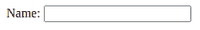
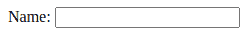

# 如何使用 jQuery 禁用浏览器对输入字段的自动填充？

> 原文:[https://www . geesforgeks . org/如何禁用浏览器-输入字段自动填充-使用-jquery/](https://www.geeksforgeeks.org/how-to-disable-browser-autofill-on-input-fields-using-jquery/)

在本文中，我们将看到如何在输入字段上禁用浏览器自动填充属性。为此，创建了一个 HTML 页面，其中导入了 jQuery CDN 以使用 jQuery，并编写了其代码。

**进场:**

*   创建一个基本的 HTML 页面，其中至少有一个带有“id”属性的输入字段。
*   从脚本标记中导入 jQuery CDN，以便在页面上使用 jQuery。
*   然后在脚本标记中编写 jQuery 代码，以禁用输入字段的自动填充。

**为了实现这一点，我们使用 jQuery 的两种方法为字段设置属性值:**

*   [attr()方法](https://www.geeksforgeeks.org/jquery-attr-method/)
*   [道具()方法](https://www.geeksforgeeks.org/jquery-prop-with-examples/)

**实施例 1:** 使用 *attr()* 方法

```html
<!DOCTYPE html>
<html lang="en">

<head>
    <meta charset="UTF-8">
    <meta name="viewport" content=
        "width=device-width,initial-scale=1.0">

    <!-- Import jQuery cdn library -->
    <script src=
"https://ajax.googleapis.com/ajax/libs/jquery/3.5.1/jquery.min.js">
    </script>

    <script>

        // Execute this code when page is
        // totally loaded
        $(document).ready(function () {

            /* Setting the autocomplete of
               input field to off to make 
               autofill to disable */
            $("#name").attr("autocomplete", "off");
        });
    </script>
</head>

<body>
    <label for="name">Name:</label>

    <input type="text" name="name" id="name">
</body>

</html>
```

**输出:**



这将是代码的输出

**例 2:** 使用 prop()方法

```html
<!DOCTYPE html>
<html lang="en">

<head>
    <meta charset="UTF-8">
    <meta name="viewport" content=
        "width=device-width, initial-scale=1.0">

    <title>Disable Autofill</title>

    <!-- Import jQuery cdn library -->
    <script src=
"https://ajax.googleapis.com/ajax/libs/jquery/3.5.1/jquery.min.js">
    </script>

    <script>

        // Execute this code when page is
        // totally loaded
        $(document).ready(function () {

            /* Setting the autocomplete of 
               input field to off to make 
               autofill to disable */
            $("#name").prop("autocomplete", "off");
        });
    </script>
</head>

<body>
    <label for="name">Name:</label>

    <input type="text" name="name" id="name">
</body>

</html>
```

**输出:**



代码输出。此字段中没有自动填充