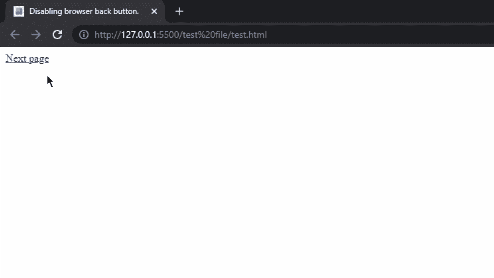

# 如何使用 jQuery 禁用浏览器后退按钮？

> 原文:[https://www . geesforgeks . org/如何禁用-浏览器-后退-按钮-使用-jquery/](https://www.geeksforgeeks.org/how-to-disable-browser-back-button-using-jquery/)

在处理一些与隐私相关的项目时，我们必须确保我们的编程没有任何漏洞。在本文中，我们将看到如何故意禁用浏览器的后退按钮，以便用户无法返回并访问内容。我们有很多场景可以使用这种功能。

例如，在支付网关页面中，我们可以禁用后退按钮，这样如果用户无意中点击了后退按钮，支付就不会被取消。为了在我们的页面上实现这个功能，我们将切换两个页面，然后，我们将限制用户返回第一个页面。

**示例:**在同一个文件夹中创建两个 HTML 文件，就像我们使用*page1.html*和*page2.html*一样。在*page1.html，*增加以下代码。

## index.html

```
<!DOCTYPE html>
<html>

<head>
    <title>Disabling browser back button</title>
    <script src=
        "https://code.jquery.com/jquery-3.6.0.min.js" 
        integrity=
"sha256-/xUj+3OJU5yExlq6GSYGSHk7tPXikynS7ogEvDej/m4=" 
        crossorigin="anonymous">
    </script>
</head>

<body>
    <a href="test2.html">Next page</a>

    <script>
        $(document).ready(function() {
            function disableBack() {
                window.history.forward()
            }
            window.onload = disableBack();
            window.onpageshow = function(e) {
                if (e.persisted)
                    disableBack();
            }
        });
    </script>
</body>

</html>
```

在第二页上，*page2.html*添加以下代码。第二页可以是任何东西，第一页很重要，因为我们使用的是第一页的脚本。

## test2.html

```
<!DOCTYPE html>
<html>

<body>
    Click on back button of browser or 
    use the backspace key on keyboard.
</body>

</html>
```

**输出:**



您也可以使用香草 JavaScript 来阻止浏览器的后退按钮，为此您可以遵循这篇[如何使用 JavaScript 停止浏览器后退按钮](https://www.geeksforgeeks.org/how-to-stop-browser-back-button-using-javascript/)的文章。