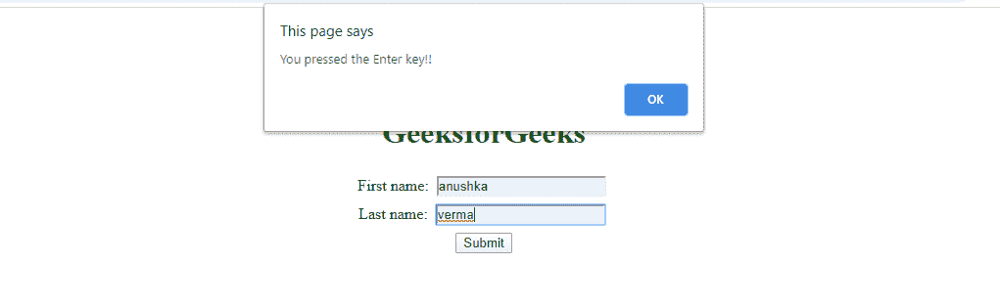

# 如何使用 jQuery 在回车按钮上禁用表单提交？

> 原文:[https://www . geesforgeks . org/如何使用-jquery/](https://www.geeksforgeeks.org/how-to-disable-form-submit-on-enter-button-using-jquery/) 禁用表单-输入时提交-按钮

提交表单有两种方法，

*   **使用“输入”键:**当用户从键盘按下“输入”键时，表单提交。只有当相关表单中的一个(或多个)元素具有焦点时，此方法才有效。
*   **使用“鼠标点击”:**用户点击“提交”表单按钮。

**做法:**首先，我们需要选择表单。这是使用查询选择器完成的:`$("#form-id")`现在，我们需要处理表单提交过程。为此，我们使用事件处理。因为我们需要用户是否按下回车键，所以我们在每个按键事件上添加一个事件监听器:`on("keypress", function (event) {} )`

这个事件处理程序将检查每一次键盘按压，所以我们需要检查“回车”键。为此，我们可以使用`event.keyCode`或`event.which;`

**event . key code:**key code 属性返回触发按键事件的按键的 Unicode 字符代码。
**事件.哪个:**属性返回为该事件按下的键盘键(或鼠标键)。
现在，我们知道按下了回车键，我们需要停止默认行为。为此，我们包括对 jQuery 方法 preventDefault()的调用，以停止事件传播。`preventDefault()`

**preventDefault():** 如果事件是可取消的，则此方法取消该事件，这意味着属于该事件的默认操作不会发生。

**示例:**

```html

<!DOCTYPE html> 
<html> 

<head> 
    <title> 
        Disable form submission on 
        pressing enter key
    </title> 

    <style> 
        body { 
            display: block; 
            margin-top: 8%; 
        } 
        h1 { 
            color:green; 
            text-align:center; 
        } 
        form {
            display: block; 
            margin: 0 auto;
            text-align: center;
        }
        input {
            margin: 4px;
        }
    </style> 

    <script
      src="https://code.jquery.com/jquery-3.4.1.min.js"
      integrity="sha256-CSXorXvZcTkaix6Yvo6HppcZGetbYMGWSFlBw8HfCJo="
      crossorigin="anonymous"></script>
</head> 

<body> 
    <h1>GeeksforGeeks</h1> 

    <form id="form-id">

        <label>First name:</label>
        <input type="text" name="first-name">
        <br />

        <label>Last name:</label>
        <input type="text" name="last-name">
        <br />

        <input type="submit" value="Submit" />
    </form> 

    <script> 
        $(window).ready(function() {
        $("#form-id").on("keypress", function (event) {
            console.log("aaya");
            var keyPressed = event.keyCode || event.which;
            if (keyPressed === 13) {
                alert("You pressed the Enter key!!");
                event.preventDefault();
                return false;
            }
        });
        });

    </script> 
</body> 

</html>                    
```

**输出:**


jQuery 是一个开源的 JavaScript 库，它简化了 HTML/CSS 文档之间的交互，它以其“少写多做”的理念而闻名。
跟随本 [jQuery 教程](https://www.geeksforgeeks.org/jquery-tutorials/)和 [jQuery 示例](https://www.geeksforgeeks.org/jquery-examples/)可以从头开始学习 jQuery。