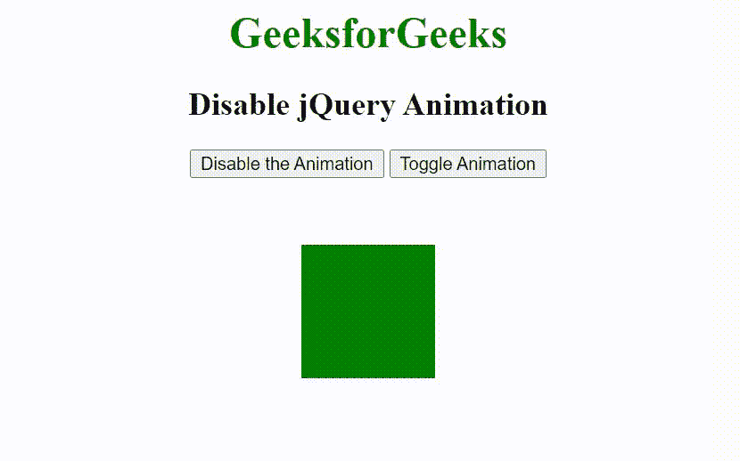

# 如何禁用 jQuery 动画？

> 原文:[https://www . geesforgeks . org/如何禁用-jquery-animation/](https://www.geeksforgeeks.org/how-to-disable-jquery-animation/)

在本文中，我们将看到如何使用 jQuery 禁用动画效果。要禁用动画效果，我们使用 **jQuery.fx.off 属性**。

[**jQuery.fx.off 属性**](https://www.geeksforgeeks.org/jquery-jquery-fx-off-property/) 用于全局启用/禁用页面的所有动画。其默认值为 false，用于允许动画正常运行。

**语法:**

```html
jQuery.fx.off = true|false;
```

**属性值:**

*   **true:** 用于指定动画应被禁用。
*   **false:** 用于指定动画应启用。

**方法:**在这里，首先我们将使用 div 元素创建一个大小为 100px 的方形盒子。创建盒子后，我们使用[切换()方法](https://www.geeksforgeeks.org/jquery-toggle-method/)在 [< div >元素](https://www.geeksforgeeks.org/div-tag-html/)上设置切换动画。此外，我们使用 jQuery.fx.off 属性来禁用切换动画效果。

**示例:**

## 超文本标记语言

```html
<!DOCTYPE html>
<html>

<head>
    <title>
        How to disable jQuery animation?
    </title>

    <script src=
"https://ajax.googleapis.com/ajax/libs/jquery/3.3.1/jquery.min.js">
    </script>

    <style>
        .box {
            background: green;
            height: 100px;
            width: 100px;
            margin: 50px;
        }
    </style>
</head>

<body>
    <center>
        <h1 style="color:green;">
            GeeksforGeeks
        </h1>

        <h2>Disable jQuery Animation</h2>

        <button id="disable">
            Disable the Animation
        </button>

        <button id="toggle">
            Toggle Animation
        </button>

        <div class="box"></div>

        <script>
            $(document).ready(function() {
                $("#disable").click(function() {
                    jQuery.fx.off = true;
                });

                $("#toggle").click(function() {
                    $("div").toggle("slow");
                });
            });
        </script>
    </center>
</body>

</html>
```

**输出:**

