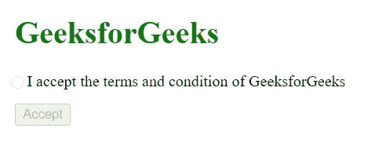

# 如何在 jQuery 中禁用或启用表单提交按钮？

> 原文:[https://www . geesforgeks . org/如何禁用或启用表单-提交-按钮-in-jquery/](https://www.geeksforgeeks.org/how-to-disable-or-enable-form-submit-button-in-jquery/)

给定一个 HTML 文档，任务是在 jQuery 中启用或禁用表单提交按钮。

**方法:**要启用或禁用表单提交按钮，我们使用下面的代码片段。

```html
$('#enabled').click(function () {
    if ($('#submit-button').is(':disabled')) {
        $('#submit-button').removeAttr('disabled');
    } else {
        $('#submit-button').attr('disabled', 'disabled');
    }
});
```

在上面的代码中， **enabled** 是所用复选框的 id，**提交按钮**是所用提交按钮的类名。

在上面方法的下面实现中，jQuery-1.11.js 包含[在这里](http://code.jquery.com/jquery-1.11.1.min.js)找到的源代码(jQuery v1.11.1)。

**示例:**下面是上述方法的实现。

## 超文本标记语言

```html
<!DOCTYPE html>
<html>

<head>
    <meta charset="utf-8">

    <title>
        Disable/enable the form submit button
    </title>

    <script src="jQuery-1.11.js"></script>

    <style>
        h1 {
            color: green;
            margin-left: 12px;
        }

        .checkbox-round {
            width: 1.0em;
            height: 1.0em;
            background-color: white;
            border-radius: 50%;
            vertical-align: middle;
            border: 1px solid #ddd;
            -webkit-appearance: none;
            outline: none;
            cursor: pointer;
            padding-right: 2px;
            margin-left: 8px;
        }

        .checkbox-round:checked {
            background-color: green;
        }

        #submit-button {
            margin-top: 12px;
            margin-left: 12px;
        }
    </style>
</head>

<body>
    <h1>GeeksforGeeks</h1>

    <input class="checkbox-round" id="enabled" 
        name="enabled" type="checkbox" value="y" />
        I accept the terms and
        conditionof GeeksforGeeks<br>

    <input id="submit-button" disabled="disabled" 
        name="Submit" type="submit" value="Accept" />

    <script>
        $('#enabled').click(function () {
            if ($('#submit-button').is(':disabled')) {
                $('#submit-button').removeAttr('disabled');
            } else {
                $('#submit-button').attr('disabled', 'disabled');
            }
        });
    </script>
</body>

</html>
```

**输出:**

