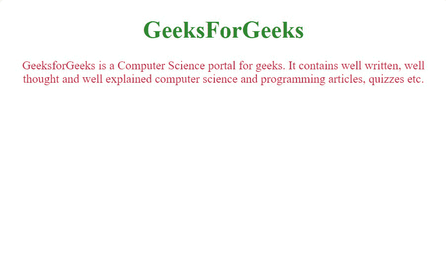

# 如何使用 jQuery 禁用右键选项？

> 原文:[https://www . geesforgeks . org/如何禁用-右键-选项-使用-jquery/](https://www.geeksforgeeks.org/how-to-disable-right-click-option-using-the-jquery/)

jQuery 中的 bind()方法用于为选定的元素附加一个或多个事件处理程序，该方法指定了一个在事件发生时运行的函数。

**语法:**

```html
$(selector).bind(event, data, function);
```

**参数:**该方法接受三个参数，如上所述，如下所述:

*   **事件:**是传递给所选元素的事件类型。
*   **数据:**是可以在所选元素上显示的数据。
*   **功能:**是由所选元素执行的功能。

**返回值:**返回对所选元素进行的所有修改。

在本文中，我们将看到如何使用 jQuery bind()方法禁用右击选项。

## 超文本标记语言

```html
<!DOCTYPE html>
<html>

<head>

    <!-- Adding jQuery scripts required to run jQuery -->
    <script src=
"https://ajax.googleapis.com/ajax/libs/jquery/3.2.1/jquery.min.js">
    </script>

    <!-- This script will prevent 
        right click -->
    <script>
        $(document).ready(function () {
            $(document).bind("contextmenu", function (e) {
                return false;
            });
        });
    </script>

    <!-- Adding style -->
    <style>
        h1 {
            color: green;
        }
        p {
            color: crimson;
        }
    </style>
</head>

<!-- Body of the page -->
<body>
    <center>
        <h1>GeeksForGeeks</h1>

        <p>
            GeeksforGeeks is a Computer Science
            portal for geeks. It contains well
            written, well thought and well
            explained computer science and
            programming articles, quizzes etc.
        </p>
    </center>
</body>

</html>
```

**输出:**



您可以看到，不能通过在屏幕上右键单击来打开右键单击选项窗口。