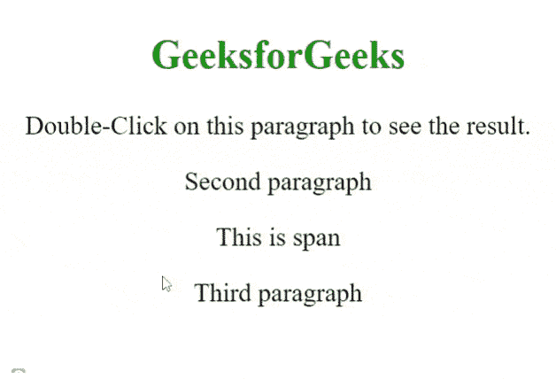

# 如何使用 jQuery 在页面所有段落显示 dblclick 事件上的消息？

> 原文:[https://www . geesforgeks . org/how-display-a-message-on-dblclick-event-on-all-of-page-use-jquery/](https://www.geeksforgeeks.org/how-to-display-a-message-on-dblclick-event-on-all-paragraphs-of-a-page-using-jquery/)

本文的目的是在页面的所有段落上向双击事件显示一条消息。每当你双击任何一个段落，消息就会出现。

**jQuery 中使用的方法:**

[**dblclick():**](https://www.geeksforgeeks.org/jquery-dblclick-with-examples/)**此方法用于触发 *dblclick* 事件，或在双击事件发生时附加一个函数运行。**

****语法:****

```html
$(selector).dblclick(optional_function);
```

****进场:****

*   **首先，创建带有一些段落元素的 HTML 页面。**
*   **使用上述语法在双击事件触发后显示一条消息。**

****示例:****

## **超文本标记语言**

```html
<!DOCTYPE html>
<html>

<head>
    <script src=
"https://ajax.googleapis.com/ajax/libs/jquery/3.5.1/jquery.min.js">
    </script>

    <style>
        body {
            text-align: center;
            font-size: 30px;
        }
    </style>

    <script>
        $(document).ready(function () {
            $("p").dblclick(function () {
                $("#result").show().html(
                    "The paragraph was double-clicked");
            });
        });
    </script>

</head>

<body>
    <h2 style="color:green">GeeksforGeeks</h2>

    <p>
        Double-Click on this paragraph 
        to see the result.
    </p>

    <p>Second paragraph</p>
    <span>This is span</span>

    <p>Third paragraph</p>

    <div style="height:10px;"></div>
    <div id="result"></div>
</body>

</html>
```

****输出:****

****