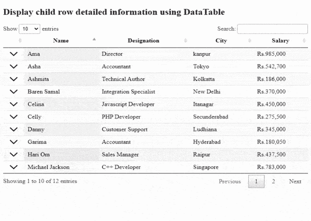

# 如何使用 jQuery DataTables 插件显示子行信息？

> 原文:[https://www . geesforgeks . org/how-display-child-row-information-use-jquery-datatables-plugin/](https://www.geeksforgeeks.org/how-to-display-child-row-information-using-jquery-datatables-plugin/)

数据表是现代 jQuery 插件，用于为我们的网页的 HTML 表添加交互式和高级控件。DataTable 是一个简单易用的 jQuery 插件，它为开发人员的自定义更改提供了许多选项。数据表的一些特性是分页、搜索、排序和多列排序。

在本文中，我们将学习使用 DataTable API 方法将子行附加到父行并显示其信息。当开发人员想要显示数据表中某一行的附加信息时，此功能非常有用。

实现代码所需的预编译文件如下。

CSS:

```html
https://cdn.datatables.net/1.10.22/css/jquery.dataTables.min.css
```

**JavaScript:**

```html
//cdn.datatables.net/1.10.22/js/jquery.dataTables.min.js
```

**方法:**在下面的示例*中，像 *employee_id、姓名、职务、工资、*和*地址*这样的员工*详细信息存在于一个 Ajax 文本文件“nestedData.txt”中。一个 HTML 表用于在行和列中存储所有的细节。

在代码的 JavaScript 部分，数据表是使用插件初始化的。单击时，会处理事件以显示和隐藏特定数据行的更多信息。这是通过使用 API 的 *row.child.show(* )和 *row.child.hide()* 方法实现的。还有其他方法。

下面代码中的 *getChildRow()* 函数定义了用户点击的子行的设计/显示内容。开发人员可以根据应用程序的需要更改代码。

**示例:**

## 超文本标记语言

```html
<!DOCTYPE html>
<html>

<head>
    <meta content="initial-scale=1, maximum-scale=1,
        user-scalable=0" name="viewport" />

    <meta name="viewport" content="width=device-width" />

    <!--Datatable plugin CSS file -->
    <link rel="stylesheet" href=
"https://cdn.datatables.net/1.10.22/css/jquery.dataTables.min.css" />

    <!--jQuery library file -->
    <script type="text/javascript" 
        src="https://code.jquery.com/jquery-3.5.1.js">
    </script>

    <!--Datatable plugin JS library file -->
    <script type="text/javascript" src=
"https://cdn.datatables.net/1.10.22/js/jquery.dataTables.min.js">
    </script>

    <style>
        td.details-control {
            /* Image in the first column to
                indicate expand*/
            background: url('images/more.png')
                no-repeat center;

            cursor: pointer;
        }

        tr.shown td.details-control {
            background: url('images/shrinkdata.PNG') 
                no-repeat center;
        }
    </style>

</head>

<body>
    <h2>
        Display child row detailed 
        information using DataTable
    </h2>

    <!--HTML tables with employee data-->
    <table id="tableID" class="display" 
        style="width:100%">

        <thead>
            <tr>
                <th></th>
                <th>Name</th>
                <th>Designation</th>
                <th>City</th>
                <th>Salary</th>
            </tr>
        </thead>

    </table>

    <script>

        /* Function for child row details*/
        function getChildRow(data) {

            // `data` is the data object for the row
            return '<table cellpadding="5" cellspacing="0"'
                + ' style="padding-left:50px;">' +
                '<tr>' +
                '<td>Full name:</td>' +
                '<td>' + data.name + '</td>' +
                '</tr>' +
                '<tr>' +
                '<td>Address in detail:</td>' +
                '<td>' + data.address + '</td>' +
                '</tr>' +
                '<tr>' +
                '<td>Extra details like ID:</td>' +
                '<td>' + data.employee_id + '</td>' +
                '</tr>' +
                '</table>';
        }

        $(document).ready(function () {

            /* Initialization of datatables */
            var table = $('#tableID').DataTable({
                "ajax": "nestedData.txt",
                "columns": [{
                    "className": 'details-control',
                    "orderable": true,
                    "data": null,
                    "defaultContent": ''
                },
                    { "data": "name" },
                    { "data": "designation" },
                    { "data": "city" },
                    { "data": "salary" }
                ],
                "order": [[1, 'asc']]
            });

            // Click events for expanding and
            // closing using up/down arrows
            $('#tableID tbody').on('click', 
            'td.details-control', function () {

                var tr = $(this).closest('tr');
                var row = table.row(tr);

                if (row.child.isShown()) {

                    // Closing the already opened row           
                    row.child.hide();

                    // Removing class to hide
                    tr.removeClass('shown');
                }
                else {

                    // Show the child row for detail
                    // information
                    row.child(getChildRow(row.data())).show();

                    // To show details,add the below class
                    tr.addClass('shown');
                }
            });
        });        
    </script>
</body>

</html>
```

**nestedData.txt** :以下是上面代码中 Ajax 选项使用的“nestedData.txt”文件的数据。

```html
{
  "data": [
    {
      "employee_id": "emp1",
      "name": "Teza",
      "designation": "Architect",
      "salary": "Rs.350,800",     
      "city": "Lucknow",
      "address": "54,komal street"
    },
    {
      "employee_id": "emp2",
      "name": "Garima",
      "designation": "Accountant",
      "salary": "Rs.180,050",    
      "city": "Hyderabad",
      "address": "Hitech city,kodapur"
    },
    {
      "employee_id": "emp3",
      "name": "Ashmita",
      "designation": "Technical Author",
      "salary": "Rs.186,000",    
      "city": "Kolkatta",
      "address": "156, new park,chowk"
    },
    {
      "employee_id": "emp4",
      "name": "Celina",
      "designation": "Javascript Developer",
      "salary": "Rs.450,000",     
      "city": "Itanagar",
      "address": "chandni chowk,new lane"
    },
    {
      "employee_id": "emp5",
      "name": "Asha",
      "designation": "Accountant",
      "salary": "Rs.542,700",   
      "city": "Tokyo",
      "address": "54,Japanese colony"
    },
    {
      "employee_id": "emp6",
      "name": "Baren Samal",
      "designation": "Integration Specialist",
      "salary": "Rs.370,000",    
      "city": "New Delhi",
      "address": "48,RK puram"
    },
    {
      "employee_id": "emp7",
      "name": "Hari Om",
      "designation": "Sales Manager",
      "salary": "Rs.437,500",     
      "city": "Raipur",
      "address": "Sector 6,bhilai"
    },
    {
      "employee_id": "emp8",
      "name": "Ranu",
      "designation": "Integration Specialist",
      "salary": "Rs.330,900",     
      "city": "Tokyo",
      "address": "64,indian colony"
    },
    {
      "employee_id": "emp9",
      "name": "Celly",
      "designation": "PHP Developer",
      "salary": "Rs.275,500",    
      "city": "Secunderabad",
      "address": "23,Sainikpuri"
    },
   {
      "employee_id": "emp55",
      "name": "Ama",
      "designation": "Director",
      "salary": "Rs.985,000",    
      "city": "kanpur",
      "address": "63,Narangi lane"
    },
    {
      "employee_id": "emp56",
      "name": "Michael Jackson",
      "designation": "C++ Developer",
      "salary": "Rs.783,000",    
      "city": "Singapore",
      "address": "53,Sweetpark"
    },
    {
      "employee_id": "emp57",
      "name": "Danny",
      "designation": "Customer Support",
      "salary": "Rs.345,000",    
      "city": "Ludhiana",
      "address": "456,Punjab"
    }
  ]
}
```

**输出:**

*   **子行显示前:**


*   **子行显示 1 后:**



*   **子行显示 2 后:**

