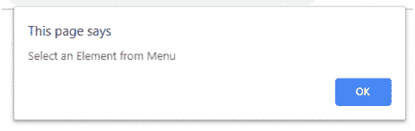

# jQuery 中如何使用下拉菜单显示 div 元素？

> 原文:[https://www . geesforgeks . org/how-display-div-elements-use-下拉菜单-in-jquery/](https://www.geeksforgeeks.org/how-to-display-div-elements-using-dropdown-menu-in-jquery/)

为了通过在 jQuery 中选择特定的下拉菜单来显示特定元素的数据/内容，我们可以通过以下方式使用:

1.  **Using hide() and show() methods:**
    *   **hide()方法:**这个方法用来隐藏你想要隐藏的 html 的语法或者元素。
        **语法:**

        ```
        $(selector).hide(speed, callback);
        ```

    *   **show()方法:**这个方法用来显示你希望用户看到的 html 的语法或者元素。
        **语法:**

        ```
        $(selector).show(speed, callback);
        ```

    **进场:**

    *   下拉菜单的选择器名称与用于显示内容的元素相同。
    *   使用**将所选元素的值存储在变量中。attr()方法**。
    *   现在检查元素是否选择了任何元素。
    *   如果是，使用 **show()** 方法显示选中元素的元素，否则使用 **hide()** 方法隐藏。

    **例 1:**

    ```
    <!DOCTYPE html>
    <html>

    <head>
        <title>How to display div elements
          using Dropdown Menu in jQuery?</title>
        <script src=
    "https://code.jquery.com/jquery-1.12.4.min.js">
      </script>
    </head>

    <body>
        <center>
            <h1 style="color:green;"> 
            GeeksForGeeks 
        </h1>
            <h3> jQuery |
              Show and Hide div elements using Dropdown Menu</h3>
            <div>
                <select>
                    <option>Select</option>
                    <option value="C">C</option>
                    <option value="Cplus">C++</option>
                    <option value="Python">Python</option>
                    <option value="Java">Java</option>
                </select>
            </div>
            <div>
                <div class="C GFG" 
                     style="padding: 30px; 
                            margin-top: 30px;
                            width :60%; 
                            background:green">
                  <strong>C</strong> 
                  is a procedural programming language
              </div>
                <div class="Cplus GFG" 
                     style="padding: 30px;
                            margin-top: 30px; 
                            width :60%;
                            background:green">
                  <strong>C++</strong> 
                  is a general purpose programming language
              </div>
                <div class="Python GFG"
                     style="padding: 30px;
                            margin-top: 30px; 
                            width :60%;
                            background:green">
                  <strong>Python</strong> 
                  is a widely used general-purpose,
                  high level programming language.
              </div>
                <div class="Java GFG"
                     style="padding: 30px;
                            margin-top: 30px; 
                            width :60%;
                            background:green">
                  <strong>Java</strong> 
                  is a most popular programming 
                  language for many years.
              </div>
            </div>
            <script type="text/javascript">
                $(document).ready(function() {
                    $("select").on('change', function() {
                        $(this).find("option:selected").each(function() {
                            var geeks = $(this).attr("value");
                            if (geeks) {
                                $(".GFG").not("." + geeks).hide();
                                $("." + geeks).show();
                            } else {
                                $(".GFG").hide();
                            }

                        });
                    }).change();
                });
            </script>
        </center>
    </body>

    </html>
    ```

    **输出:**
    **选择任意单选按钮前:**
    
    **选择单选按钮后:**
    

    **例 2:** 连同报警方法

    ```
    <!DOCTYPE html>
    <html>

    <head>
        <title> How to display div elements
          using Dropdown Menu in jQuery?</title>
        <script src=
    "https://code.jquery.com/jquery-1.12.4.min.js">
      </script>
    </head>

    <body>
        <center>
            <h1 style="color:green;"> 
            GeeksForGeeks 
        </h1>
            <h3> jQuery | Show
              and Hide div elements using Dropdown Menu
          </h3>
            <div>
                <select>
                    <option>Select</option>
                    <option value="C">C</option>
                    <option value="Cplus">C++</option>
                    <option value="Python">Python</option>
                    <option value="Java">Java</option>
                </select>
            </div>
            <div>
                <div class="C GFG" 
                     style="padding: 30px;
                            margin-top: 30px;
                            width :60%; 
                            background:green">
                  <strong>C</strong> 
                  is a procedural programming language
              </div>
                <div class="Cplus GFG" 
                     style="padding: 30px;
                            margin-top: 30px; 
                            width :60%; 
                            background:green">
                  <strong>C++</strong> 
                  is a general purpose programming language
              </div>
                <div class="Python GFG"
                     style="padding: 30px; 
                            margin-top: 30px;
                            width :60%; 
                            background:green">
                  <strong>Python</strong> 
                  is a widely used general-purpose,
                  high level programming language.
              </div>
                <div class="Java GFG"
                     style="padding: 30px;
                            margin-top: 30px;
                            width :60%; 
                            background:green">
                  <strong>Java</strong> 
                  is a most popular programming language for many years.
              </div>
            </div>
            <script type="text/javascript">
                $(document).ready(function() {
                    $("select").on('change', function() {
                        $(this).find("option:selected").each(function() {
                            var geeks = $(this).attr("value");
                            if (geeks) {
                                $(".GFG").not("." + geeks).hide();
                                $("." + geeks).show();
                                alert("Radio button " + geeks + " is selected");
                            } else {
                                $(".GFG").hide();
                                alert("Select an Element from Menu");
                            }

                        });
                    }).change();
                });
            </script>
        </center>
    </body>

    </html>
    ```

    **输出:**
    

2.  **Using css() method:**
    **.css() method:** This method in JQuery is used to change style property of the selected element.

    **语法:**

    ```
    $(selector).css(property)
    ```

    **进场:**

    *   下拉菜单的选择器名称与用于显示内容的元素相同。
    *   使用**从列表中找到所选元素。find()方法**。
    *   现在检查元素选择了哪个元素。
    *   现在使用**更改所选元素的显示属性。css()** 方法。

    **示例:**

    ```
    <!DOCTYPE html>
    <html>

    <head>
        <title>How to display div 
          elements using Dropdown Menu in jQuery?
      </title>
        <script src=
    "https://code.jquery.com/jquery-1.12.4.min.js">
        </script>
    </head>

    <body>
        <center>
            <h1 style="color:green;"> 
            GeeksForGeeks 
        </h1>
            <h3> jQuery | Show and
              Hide div elements using Dropdown Menu</h3>
            <div>
                <select>
                    <option>Select</option>
                    <option value="C">C</option>
                    <option value="Cplus">C++</option>
                    <option value="Python">Python</option>
                    <option value="Java">Java</option>
                </select>
            </div>
            <div>
                <div class="C GFG"
                     style="padding: 30px; 
                            margin-top: 30px;
                            width :60%;
                            background:green">
                    <strong>C</strong> 
                  is a procedural programming language
                </div>
                <div class="Cplus GFG" 
                     style="padding: 30px;
                            margin-top: 30px;
                            width :60%;
                            background:green">
                    <strong>C++</strong> 
                  is a general purpose programming language
                </div>
                <div class="Python GFG" 
                     style="padding: 30px;
                            margin-top: 30px;
                            width :60%;
                            background:green">
                    <strong>Python</strong> 
                  is a widely used general-purpose,
                  high level programming language.
                </div>
                <div class="Java GFG"
                     style="padding: 30px;
                            margin-top: 30px;
                            width :60%;
                            background:green">
                    <strong>Java</strong> 
                  is a most popular programming language for many years.
                </div>
            </div>

            <script type="text/javascript">
                $(document).ready(function() {
                    $("select").on('change', function() {
                        $(this).find(
                            "option:selected").each(function() {
                            $(".C").css('display', (
                              this.value == 'C') ? 'block' : 'none');
                            $(".Cplus").css('display', (
                              this.value == 'Cplus') ? 'block' : 'none');
                            $(".Python").css('display', (
                              this.value == 'Python') ? 'block' : 'none');
                            $(".Java").css('display', (
                              this.value == 'Java') ? 'block' : 'none');
                        });
                    }).change();
                });
            </script>
        </center>
    </body>

    </html>
    ```

    **输出:**
    **选择任意单选按钮前:**
    
    **选择单选按钮后:**
    