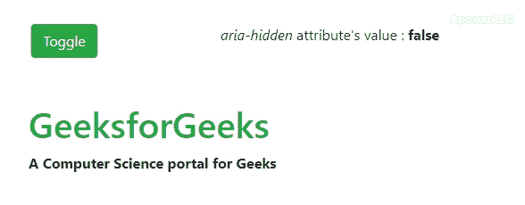

# 如何在 jQuery 中使用 aria-hidden 属性显示/隐藏函数？

> 原文:[https://www . geesforgeks . org/how-display-hide-functions-using-aria-hidden-attribute-in-jquery/](https://www.geeksforgeeks.org/how-to-display-hide-functions-using-aria-hidden-attribute-in-jquery/)

**“咏叹调-隐藏”**属性在**网页可访问性**的上下文中起着重要作用。这是一种让残疾人更容易访问网络内容/应用程序的简单方法。根据实现，该属性用于指示元素及其所有后代对于任何用户都是不可见或不可感知的。现在在你的脑海中可能会出现一个问题,“隐藏”和“咏叹调-隐藏”的属性有什么区别？
制定此解决方案的主要方面是，仅当内容在屏幕上可见时，才使内容可读，否则应保持不可访问。在这里，我们将使用 [**attr()**](https://www.geeksforgeeks.org/jquery-attr-method/) 方法来做同样的事情，该方法用于设置/获取元素的属性。
**语法:**

```
Getter: $([selector]).attr('attribute');
Setter: $([selector]).attr('attribute', 'value');
```

以下示例说明了上述方法:
**示例:**

## 超文本标记语言

```
<!DOCTYPE html>
<html>

<head>
  <title>
    aria-hidden attribute on JQuery Show/Hide functions
  </title>

    <!-- Added support for BS3 and jQuery using CDN -->
    <link rel="stylesheet" href=
"https://stackpath.bootstrapcdn.com/bootstrap/4.4.1/css/bootstrap.min.css">
    <script src=
"https://code.jquery.com/jquery-3.4.1.slim.min.js">
    </script>
    <script src=
"https://cdn.jsdelivr.net/npm/popper.js@1.16.0/dist/umd/popper.min.js">
    </script>
    <script src=
"https://stackpath.bootstrapcdn.com/bootstrap/4.4.1/js/bootstrap.min.js">
    </script>
    <style>
        .access {
            margin-left: 90px;
        }
    </style>
</head>

<body>
    <br><br>
    <div class="row">
        <div class="col-sm-4">

            <!-- button to toggle attribute -->
            <center>
                <button class="btn btn-success">
                  Toggle
                </button>
            </center>
        </div>
        <div class="col-sm-8">
            <!-- Attribute's value -->

<p><i>aria-hidden</i> attribute's value :
                <b>
                  <span id="answer">false</span>
                </b>
            </p>

        </div>
    </div>
    <br>
    <br>
    <div class="container-fluid">
        <div class="access" aria-hidden="false">
            <!-- For Content accessibility -->
            <h1 class="text-success">
              GeeksforGeeks
            </h1>
            <b>
              A Computer Science portal for Geeks
            </b>
        </div>
    </div>

    <script>
        $(document).ready(function() {
            $('button').click(function() {

                /*Check and alternate attribute's value,
                then show/hide accordingly using chaining. */
                if ($('.access')
                    .attr('aria-hidden') == 'true')
                    $('.access')
                    .attr('aria-hidden', 'false')
                    .show('fast');
                else
                    $('.access')
                    .attr('aria-hidden', 'true')
                    .hide('slow');

                // Display changed attribute's value
                $('#answer')
                .text($('.access')
                      .attr('aria-hidden'));
            });
        });
    </script>
</body>

</html>
```

**输出:**

