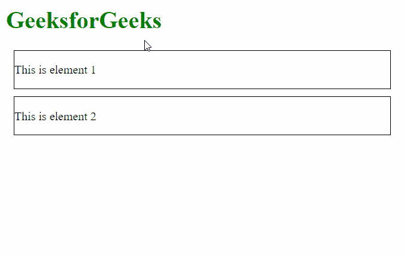

# 使用 jQuery 触发 contextmenu 事件时如何显示消息？

> 原文:[https://www . geesforgeks . org/how-display-message-on-context menu-event-被触发时使用-jquery/](https://www.geeksforgeeks.org/how-to-display-message-when-the-contextmenu-event-is-triggered-using-jquery/)

在本文中，我们将学习如何在使用 jQuery 触发 contextmenu 事件时显示消息。浏览器中的上下文菜单是用户右键单击时出现的带有多个选项的菜单。

**方法:**我们将使用*上下文菜单*事件来检查用户是否触发了页面上的上下文菜单。这可以通过两种方式实现。第一种方法是使用 **contextmenu()** 方法，该方法监听使用它的元素上的 *contextmenu* 事件。第二种是使用 **on()** 方法监听 *contextmenu* 事件。然后可以使用事件处理函数向用户显示消息。

**语法:**

```
$("element_selected").contextmenu(function () {
   alert("Message to be displayed");
});
```

运筹学

```
$("element_selected").on('contextmenu', function () {
  alert("Message to be displayed");
});
```

**示例:**本示例显示了触发 contextmenu 事件时显示消息的两种方式。

## 超文本标记语言

```
<html>
<head>
  <!-- Getting the jQuery library -->
  <script src=
"https://code.jquery.com/jquery-git.js">
  </script>
  <style>
    .elem1, .elem2 {
      height: 50px;
      border: 1px solid;
      margin: 10px;
    }
  </style>
</head>
<body>
  <h1 style="color: green;">
    GeeksforGeeks
  </h1>

  <div class="elem1">

<p>This is element 1</p>

  </div>

  <div class="elem2">

<p>This is element 2</p>

  </div>
  <script>

    // Using the contextmenu() method
    // to display the message
    $(".elem1").contextmenu(function () {

      // Display the message
      alert("Element 1 message");
    });

    // Using the on() method to check
    // for the contextmenu event
    $(".elem2").on('contextmenu', function () {

      // Display the message
      alert("Element 2 message");
    });
  </script>
</body>
</html>
```

**输出:**写点击任意 div。

