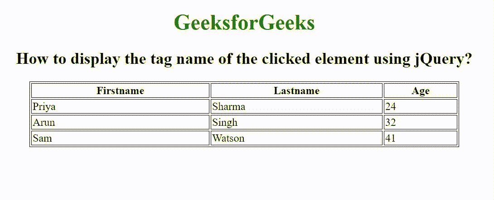

# 如何使用 jQuery 显示被点击元素的标签名？

> 原文:[https://www . geeksforgeeks . org/如何使用-jquery/](https://www.geeksforgeeks.org/how-to-display-the-tag-name-of-the-clicked-element-using-jquery/) 显示被点击元素的标签名称

给定一个包含一些元素的 HTML 文档，任务是显示被点击的元素。

**方法:**首先我们创建一个包含一些元素的 HTML 文档，并添加一个 jQuery 函数来显示被点击的元素。我们使用 jQuery 选择器选择 HTML 主体，当用户单击元素时，然后获取元素名称，并使用 text()方法在屏幕上显示元素名称。

**语法:**

```html
$("*", document.body).click(function (event) {
    event.stopPropagation();
    var domElement = $(this).get(0);
    $("h3:first").text("Clicked Element: "
                + domElement.nodeName);
});
```

**示例:**

## 超文本标记语言

```html
<!DOCTYPE html>
<html>

<head>
    <script src=
"//code.jquery.com/jquery-1.11.1.min.js">
    </script>

    <meta charset="utf-8">
    <title>
        How to display the tag name of the
        clicked element using jQuery?
    </title>

    <style>
        table,
        th,
        td {
            border: 1px solid black;
        }
    </style>
</head>

<body>
    <center>
        <h1 style="color: green;">
            GeeksforGeeks
        </h1>

        <h2>
            How to display the tag name of the
            clicked element using jQuery?
        </h2>

        <table style="width:50%">
            <tr>
                <th>Firstname</th>
                <th>Lastname</th>
                <th>Age</th>
            </tr>
            <tr>
                <td>Priya</td>
                <td>Sharma</td>
                <td>24</td>
            </tr>
            <tr>
                <td>Arun</td>
                <td>Singh</td>
                <td>32</td>
            </tr>
            <tr>
                <td>Sam</td>
                <td>Watson</td>
                <td>41</td>
            </tr>
        </table>

        <h3></h3>
    </center>

    <script>
        $("*", document.body).click(function (event) {
            event.stopPropagation();
            var domElement = $(this).get(0);
            $("h3:first").text("Clicked Element: "
                + domElement.nodeName);
        });
    </script>
</body>

</html>
```

**输出:**

