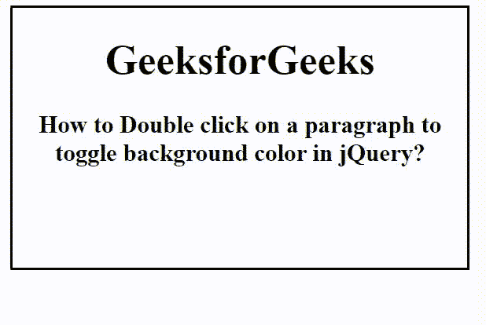

# 如何在 jQuery 中双击 div 元素切换背景色？

> 原文:[https://www . geeksforgeeks . org/如何双击-a-div-element-toggle-background-color-in-jquery/](https://www.geeksforgeeks.org/how-to-double-click-on-a-div-element-to-toggle-background-color-in-jquery/)

在本文中，我们将看到如何在段落元素上创建双击事件来切换 jQuery 中的背景色。要在双击时切换 div 元素的背景颜色，可以使用 toggleClass()方法。toggleClass()方法用于切换或更改附加了所选元素的类。

**语法:**

```html
$(selector).dblclick(function() {
    $(selector).toggleClass("element");
})
```

**示例:**

## 超文本标记语言

```html
<!DOCTYPE html>
<html>

<head>
    <title>
        How to Double click on a paragraph to
        toggle background color in jQuery?
    </title>

    <script src=
"https://ajax.googleapis.com/ajax/libs/jquery/3.3.1/jquery.min.js">
    </script>

    <script>
        $(document).ready(function () {
            var block = $(".main");
            block.dblclick(function () {
                block.toggleClass("GFG");
            });
        });
    </script>

    <style>
        body {
            text-align: center;
        }

        .main {
            width: 350px;
            height: 200px;
            border: 2px solid black;
        }

        .GFG {
            background: green;
            color: white;
        }
    </style>
</head>

<body>
    <div class="main">
        <h1>GeeksforGeeks</h1>

        <h3>
            How to Double click on a paragraph to
            <br>toggle background color in jQuery?
        </h3>
    </div>
</body>

</html>
```

**输出:**

