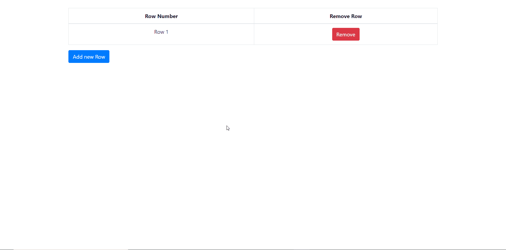

# 如何使用 jQuery 动态添加/删除表行？

> 原文:[https://www . geesforgeks . org/如何使用-jquery/](https://www.geeksforgeeks.org/how-to-dynamically-add-remove-table-rows-using-jquery/) 动态添加-删除-表-行

在本文中，我们将学习如何使用 jQuery 从 HTML 表中动态添加/删除行。在阅读本文之前，请确保您对 jQuery 有一些基本的了解。如果没有，可以从下面提到的链接中学习。

1.  [jQuery 教程](https://www.geeksforgeeks.org/jquery-tutorials/)
2.  [jQuery 官方 API 文档](https://api.jquery.com/)

**HTML 代码:**我们先来定义一下网页的基本 HTML 结构。

## 超文本标记语言

```html
<body>
  <div class="container pt-4">
    <div class="table-responsive">
      <table class="table table-bordered">
        <thead>
          <tr>
            <th class="text-center">Row Number</th>
            <th class="text-center">Remove Row</th>
          </tr>
        </thead>
        <tbody id="tbody">

        </tbody>
      </table>
    </div>
    <button class="btn btn-md btn-primary" 
        id="addBtn" type="button">
      Add new Row
    </button>
  </div>
</body>
```

最初，表是空的，没有行。我们将从在表体中动态添加行开始，然后看看如何从表中删除一行。

**添加一行:**
要添加一行，请定义一个变量来记录表中现在存在的总行数。然后我们将使用 jQuery“click”事件来检测对添加行按钮的点击，然后使用[。append()](https://api.jquery.com/append/) 方法的 jQuery 在表中添加一行。每个行元素都被分配了一个 id **Ri** ，我们稍后将使用它来删除一行。每个元素都有一个行索引列，并删除按钮列。代码如下。

## java 描述语言

```html
// Node.js program to demonstrate the
// Node.js filehandle.read() Method

// Denotes total number of rows.
var rowIdx = 0;

// jQuery button click event to add a row.
$('#addBtn').on('click', function () {

    // Adding a row inside the tbody.
    $('#tbody').append(`<tr id="R${++rowIdx}">
          <td class="row-index text-center">
                <p>Row ${rowIdx}</p></td>
           <td class="text-center">
            <button class="btn btn-danger remove" 
                type="button">Remove</button>
            </td>
           </tr>`);
});
```

**注意:**在新的 JavaScript ES6 语法中，` R${var} '是一种将变量与字符串连接起来的方式。
**拆排:**拆排有点复杂。有两个问题。首先，由于每一行都是动态添加的，我们不能通过使用“click”jQuery 事件直接检测删除按钮的点击，因为它是一个“直接”绑定，将处理程序附加到已经存在的元素上。它不会受到未来因素的束缚。其次，当我们删除一行时，我们需要保持索引，也就是说，如果我们删除第二行，第三行将成为第二行，因此我们需要修改 id 和行索引文本。
为了解决第一个问题，我们将使用[委托](https://learn.jquery.com/events/event-delegation/#:~:text=Event%20delegation%20refers%20to%20the, Inside%20the%20Event%20Handling%20Function)，然后我们可以处理动态添加的元素的事件。
为了解决第二个问题，我们将使用[获取点击移除按钮的行旁边的所有行。方法，然后遍历这些元素中的每一个来修改行索引和行 id。代码如下:](https://api.jquery.com/nextAll/)

## java 描述语言

```html
// Node.js program to demonstrate the
// Node.js filehandle.read() Method

// jQuery button click event to remove a row
$('#tbody').on('click', '.remove', function () {

    // Getting all the rows next to the 
    // row containing the clicked button
    var child = $(this).closest('tr').nextAll();

    // Iterating across all the rows 
    // obtained to change the index
    child.each(function () {

        // Getting <tr> id.
        var id = $(this).attr('id');

        // Getting the <p> inside the .row-index class.
        var idx = $(this).children('.row-index').children('p');

        // Gets the row number from <tr> id.
        var dig = parseInt(id.substring(1));

        // Modifying row index.
        idx.html(`Row ${dig - 1}`);

        // Modifying row id.
        $(this).attr('id', `R${dig - 1}`);
    });

    // Removing the current row.
    $(this).closest('tr').remove();

    // Decreasing the total number of rows by 1.
    rowIdx--;
});
```

该代码可以根据需要以多种方式修改。例如，您可以尝试修复表中的第一行，以便表体中始终至少存在一行。如果行数为 1，则不能删除该行。

**最终代码:**以下代码是上述部分的组合。

```html
<!DOCTYPE html>
<html>

<head>
  <title>test page</title>
  <link rel="stylesheet" href=
"https://stackpath.bootstrapcdn.com/bootstrap/4.4.1/css/bootstrap.min.css"
    integrity=
"sha384-Vkoo8x4CGsO3+Hhxv8T/Q5PaXtkKtu6ug5TOeNV6gBiFeWPGFN9MuhOf23Q9Ifjh"
    crossorigin="anonymous">

  <script src=
"https://ajax.googleapis.com/ajax/libs/jquery/3.4.1/jquery.min.js">
  </script>
  <script src=
"https://cdnjs.cloudflare.com/ajax/libs/popper.js/1.14.7/umd/popper.min.js">
  </script>
  <script src=
"https://maxcdn.bootstrapcdn.com/bootstrap/4.3.1/js/bootstrap.min.js">
  </script>

  <script>
    $(document).ready(function () {

      // Denotes total number of rows
      var rowIdx = 0;

      // jQuery button click event to add a row
      $('#addBtn').on('click', function () {

        // Adding a row inside the tbody.
        $('#tbody').append(`<tr id="R${++rowIdx}">
             <td class="row-index text-center">
             <p>Row ${rowIdx}</p>
             </td>
              <td class="text-center">
                <button class="btn btn-danger remove"
                  type="button">Remove</button>
                </td>
              </tr>`);
      });

      // jQuery button click event to remove a row.
      $('#tbody').on('click', '.remove', function () {

        // Getting all the rows next to the row
        // containing the clicked button
        var child = $(this).closest('tr').nextAll();

        // Iterating across all the rows 
        // obtained to change the index
        child.each(function () {

          // Getting <tr> id.
          var id = $(this).attr('id');

          // Getting the <p> inside the .row-index class.
          var idx = $(this).children('.row-index').children('p');

          // Gets the row number from <tr> id.
          var dig = parseInt(id.substring(1));

          // Modifying row index.
          idx.html(`Row ${dig - 1}`);

          // Modifying row id.
          $(this).attr('id', `R${dig - 1}`);
        });

        // Removing the current row.
        $(this).closest('tr').remove();

        // Decreasing total number of rows by 1.
        rowIdx--;
      });
    });
  </script>
</head>

<body>
  <div class="container pt-4">
    <div class="table-responsive">
      <table class="table table-bordered">
        <thead>
          <tr>
            <th class="text-center">Row Number</th>
            <th class="text-center">Remove Row</th>
          </tr>
        </thead>
        <tbody id="tbody">

        </tbody>
      </table>
    </div>
    <button class="btn btn-md btn-primary" 
      id="addBtn" type="button">
        Add new Row
    </button>
  </div>
</body>

</html>
```



HTML 是网页的基础，通过构建网站和网络应用程序用于网页开发。您可以通过以下 [HTML 教程](https://www.geeksforgeeks.org/html-tutorials/)和 [HTML 示例](https://www.geeksforgeeks.org/html-examples/)从头开始学习 HTML。

CSS 是网页的基础，通过设计网站和网络应用程序用于网页开发。你可以通过以下 [CSS 教程](https://www.geeksforgeeks.org/css-tutorials/)和 [CSS 示例](https://www.geeksforgeeks.org/css-examples/)从头开始学习 CSS。

jQuery 是一个开源的 JavaScript 库，它简化了 HTML/CSS 文档之间的交互，它以其“少写多做”的理念而闻名。
跟随本 [jQuery 教程](https://www.geeksforgeeks.org/jquery-tutorials/)和 [jQuery 示例](https://www.geeksforgeeks.org/jquery-examples/)可以从头开始学习 jQuery。