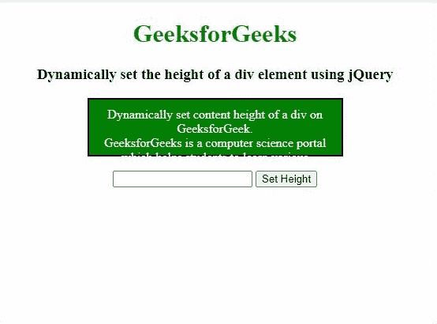

# 如何使用 jQuery 动态设置 div 元素的高度和宽度？

> 原文:[https://www . geeksforgeeks . org/如何使用-jquery/](https://www.geeksforgeeks.org/how-to-dynamically-set-the-height-and-width-of-a-div-element-using-jquery/) 动态设置 div 元素的高度和宽度

**使用 jQuery** 设置 div 元素的高度

div 的内容高度可以根据用户需求，使用 height()、innerHeight()和 outerHeight()方法动态设置或更改。如果用户想要动态更改 div 的内容高度，它包括更改实际高度、带填充的实际高度以及带填充和边框的实际高度，那么用户可以使用以下任何方法来动态设置元素内容的高度。

*   **使用[高度()方法](https://www.geeksforgeeks.org/jquery-height-and-innerheight-with-examples/)**
*   **使用[内高()方法](https://www.geeksforgeeks.org/jquery-height-and-innerheight-with-examples/)T3】**
*   **使用[外高()方法](https://www.geeksforgeeks.org/jquery-outerheight-method/)T3】**

**示例 1:** 使用 **height()方法**的 div 内容高度将更改元素内容的高度，不包括元素的填充、边框和边距。

## 超文本标记语言

```html
<!DOCTYPE html> 
<html> 

<head> 
    <title>
        How to dynamically set the height of 
        a div element using jQuery?
    </title>
    <script src=
"https://code.jquery.com/jquery-1.12.4.min.js">
    </script>

    <style> 
        #div1 { 
            height: 50px; 
            width: 300px; 
            border: 2px solid black;  
        } 

        h1 { 
            color: green; 
        } 
        .box{
            background: green;
            border: 1px solid #ccc;
            color: white;
        }
    </style> 
</head> 

<body> 
    <center> 
        <h1>GeeksforGeeks</h1> 
        <h3>Dynamically set the height of
        a div element using jQuery</h3> 

        <div id="div1" class="box"> 
            Dynamically set content height of
            a div on GeeksforGeek.<br>
            GeeksforGeeks is 
            a computer science portal which 
            helps students to learn various  
            programming language and master 
            data structures and algorithms.  
            There are various courses available 
            to learn new skills. 
        </div> 
        <br> 
        <form>
            <input type="text" class="geeks1">
            <button type="button" class="geeks2">
                Set Height
            </button>
        </form>

        <p id="p1"></p>
        <p id="p2"></p>
    </center> 

    <script> 
        $(document).ready(function(){
            $(".geeks2").click(function(){

                var demo ="Previous-height: "+ 
                           $("#div1").height(); 
                           + "px";
                $("#p1").text(demo);

                var newHeight = $(".geeks1").val();
                $(".box").height(newHeight);

                demo = "New-height: "+ 
                           $("#div1").height(); 
                           + "px";
                $("#p2").text(demo);
            });
        });
    </script> 
</body> 

</html>
```

**输出:**


**示例 2:** 使用 **innerHeight()方法**对 div 的内容高度进行修改将会改变元素内容的高度，包括元素的填充。

## 超文本标记语言

```html
<!DOCTYPE html> 
<html> 

<head> 
    <title>
        How to dynamically set the height 
        of a div element using jQuery?
    </title>

    <script src=
"https://code.jquery.com/jquery-1.12.4.min.js">
    </script>

    <style> 
        #div1 { 
            height: 50px; 
            width: 300px; 
            border: 2px solid black;
            padding : 10px;
        } 

        h1 { 
            color: green; 
        } 
        .box{
            background: green;
            border: 1px solid #ccc;
            color: white;
        }
    </style> 
</head> 

<body> 
    <center> 
        <h1>GeeksforGeeks</h1> 
        <h3>Dynamically set the height of
        a div element using jQuery</h3> 

        <div id="div1" class="box"> 
            Dynamically set content height
            of a div on GeeksforGeek.<br>
            GeeksforGeeks is 
            a computer science portal which 
            helps students to learn various  
            programming language and master 
            data structures and algorithms.  
            There are various courses available 
            to learn new skills. 
        </div> 
        <br> 
        <form>
            <input type="text" class="geeks1">
            <button type="button" class="geeks2">
                Set Height
            </button>
        </form>

        <p id="p1"></p>
        <p id="p2"></p>
    </center> 

    <script> 
        $(document).ready(function(){
            $(".geeks2").click(function(){

                var demo ="Previous-height(+Padding) : "
                           + $("#div1").innerHeight(); 
                           + "px";
                $("#p1").text(demo);

                var newHeight = $(".geeks1").val();
                $(".box").innerHeight(newHeight);

                demo = "New-height(+Padding) : "+ 
                           $("#div1").innerHeight(); 
                           + "px";
                $("#p2").text(demo);
            });
        });
    </script> 
</body> 

</html>
```

**输出:**



**示例 3:** 使用 **outerHeight()方法**对 div 的内容高度进行更改将会改变元素内容的高度，包括元素的填充和边框。

## 超文本标记语言

```html
<!DOCTYPE html> 
<html> 

<head> 
    <title>
        How to dynamically set the height 
        of a div element using jQuery?
    </title>

    <script src=
"https://code.jquery.com/jquery-1.12.4.min.js">
    </script>

    <style> 
        #div1 { 
            height: 50px; 
            width: 300px; 
            border: 2px solid black;
            padding : 10px;
        } 

        h1 { 
            color: green; 
        } 
        .box{
            background: green;
            border: 1px solid #ccc;
            color: white;
        }
    </style> 
</head> 

<body> 
    <center> 
        <h1>GeeksforGeeks</h1> 
        <h3>Dynamically set the height of
        a div element using jQuery</h3> 

        <div id="div1" class="box"> 
            Dynamically set content height 
            of a div  on GeeksforGeek.<br>
            GeeksforGeeks is 
            a computer science portal which 
            helps students to learn various  
            programming language and master 
            data structures and algorithms.  
            There are various courses available 
            to learn new skills. 
        </div> 
        <br> 
        <form>
            <input type="text" class="geeks1">
            <button type="button" class="geeks2">
                Set Height
            </button>
        </form>

        <p id="p1"></p>
        <p id="p2"></p>
    </center> 

    <script> 
        $(document).ready(function(){
            $(".geeks2").click(function(){

                var demo ="Previous-height(border+Padding) : " 
                           + $("#div1").outerHeight(); 
                           + "px";
                $("#p1").text(demo);

                var newHeight = $(".geeks1").val();
                $(".box").outerHeight(newHeight);

                demo = "New-height(border+Padding) : "
                           + $("#div1").outerHeight(); 
                           + "px";
                $("#p2").text(demo);
            });
        });
    </script> 
</body> 

</html>
```

**输出:**


**使用 jQuery** 设置 div 元素的宽度

div 的内容宽度可以根据用户需求，使用 width()、innerWidth()和 outerWidth()方法动态设置或更改。如果用户想要动态更改 div 的内容宽度，它包括更改实际宽度、带填充的实际宽度以及带填充和边框的实际宽度，那么用户可以使用以下任何方法来动态设置元素内容的宽度。

*   **使用宽度()方法**
*   **使用 innerWidth()方法**
*   **使用外部宽度()方法**

**示例 1:** 使用 **width()方法**的 div 内容宽度将更改元素内容的宽度，不包括元素的填充、边框和边距。

## 超文本标记语言

```html
<!DOCTYPE html> 
<html> 

<head> 
    <title>
        How to dynamically set the width 
        of a div element using jQuery?
    </title>

    <script src=
"https://code.jquery.com/jquery-1.12.4.min.js">
    </script>

    <style> 
        #div1 { 
            height: 100px; 
            width: 200px; 
            border: 2px solid black;
            padding : 10px;
        } 

        h1 { 
            color: green; 
        } 
        .box{
            background: green;
            border: 1px solid #ccc;
            color: white;
        }
    </style> 
</head> 

<body> 
    <center> 
        <h1>GeeksforGeeks</h1> 
        <h3>Dynamically set the width of
        a div element using jQuery</h3> 

        <div id="div1" class="box"> 
            Dynamically set content width of a div  
            on GeeksforGeek.<br>
            GeeksforGeeks is 
            a computer science portal which 
            helps students to learn various  
            programming language and master 
            data structures and algorithms.  
            There are various courses available 
            to learn new skills. 
        </div> 
        <br> 
        <form>
            <input type="text" class="geeks1">
            <button type="button" class="geeks2">
                Set Width
            </button>
        </form>

        <p id="p1"></p>
        <p id="p2"></p>
    </center> 

    <script> 
        $(document).ready(function(){
            $(".geeks2").click(function(){

                var demo ="Previous-width : "+ 
                           $("#div1").width(); 
                           + "px";
                $("#p1").text(demo);

                var newWidth = $(".geeks1").val();
                $(".box").width(newWidth);

                demo = "New-width : "+ 
                           $("#div1").width(); 
                           + "px";
                $("#p2").text(demo);
            });
        });
    </script> 
</body> 

</html>
```

**输出:**


**示例 2:** 使用 **innerWidth()方法**对 div 的内容宽度进行更改，包括元素的填充。

## 超文本标记语言

```html
<!DOCTYPE html> 
<html> 

<head> 
    <title>
        How to dynamically set the width 
        of a div element using jQuery?
    </title>

    <script src=
"https://code.jquery.com/jquery-1.12.4.min.js">
    </script>

    <style> 
        #div1 { 
            height: 100px; 
            width: 200px; 
            border: 2px solid black;
            padding : 10px;
        } 

        h1 { 
            color: green; 
        } 
        .box{
            background: green;
            border: 1px solid #ccc;
            color: white;
        }
    </style> 
</head> 

<body> 
    <center> 
        <h1>GeeksforGeeks</h1> 
        <h3>Dynamically set the width of
        a div element using jQuery</h3> 

        <div id="div1" class="box"> 
            Dynamically set content width of a div  
            on GeeksforGeek.<br>
            GeeksforGeeks is 
            a computer science portal which 
            helps students to learn various  
            programming language and master 
            data structures and algorithms.  
            There are various courses available 
            to learn new skills. 
        </div> 
        <br> 
        <form>
            <input type="text" class="geeks1">
            <button type="button" class="geeks2">
                Set Width
            </button>
        </form>

        <p id="p1"></p>
        <p id="p2"></p>
    </center> 

    <script> 
        $(document).ready(function(){
            $(".geeks2").click(function(){

                var demo ="Previous-width(+Padding) : "+ 
                           $("#div1").innerWidth(); 
                           + "px";
                $("#p1").text(demo);

                var newWidth = $(".geeks1").val();
                $(".box").innerWidth(newWidth);

                demo = "New-width(+Padding) : "+ 
                           $("#div1").innerWidth(); 
                           + "px";
                $("#p2").text(demo);
            });
        });
    </script> 
</body> 

</html>
```

**输出:**


**示例 3:** 使用**outwidth()方法**对 div 的内容宽度进行更改将会改变元素内容的宽度，包括元素的填充和边框。

## 超文本标记语言

```html
<!DOCTYPE html> 
<html> 

<head> 
    <title>
        How to dynamically set the width 
        of a div element using jQuery?
    </title>

    <script src=
"https://code.jquery.com/jquery-1.12.4.min.js">
    </script>

    <style> 
        #div1 { 
            height: 100px; 
            width: 200px; 
            border: 2px solid black;
            padding : 10px;
        } 

        h1 { 
            color: green; 
        } 
        .box{
            background: green;
            border: 1px solid #ccc;
            color: white;
        }
    </style> 
</head> 

<body> 
    <center> 
        <h1>GeeksforGeeks</h1> 
        <h3>Dynamically set the width of
        a div element using jQuery</h3> 

        <div id="div1" class="box"> 
            Dynamically set content width of a div  
            on GeeksforGeek.<br>
            GeeksforGeeks is 
            a computer science portal which 
            helps students to learn various  
            programming language and master 
            data structures and algorithms.  
            There are various courses available 
            to learn new skills. 
        </div> 
        <br> 
        <form>
            <input type="text" class="geeks1">
            <button type="button" class="geeks2">
                Set Width
            </button>
        </form>

        <p id="p1"></p>
        <p id="p2"></p>
    </center> 

    <script> 
        $(document).ready(function(){
            $(".geeks2").click(function(){

                var demo ="Previous-width(border+Padding) : "+ 
                           $("#div1").outerWidth(); 
                           + "px";
                $("#p1").text(demo);

                var newWidth = $(".geeks1").val();
                $(".box").outerWidth(newWidth);

                demo = "New-width(border+Padding) : "+ 
                           $("#div1").outerWidth(); 
                           + "px";
                $("#p2").text(demo);
            });
        });
    </script> 
</body> 

</html>
```

**输出:**


jQuery 是一个开源的 JavaScript 库，它简化了 HTML/CSS 文档之间的交互，它以其“少写多做”的理念而闻名。
跟随本 [jQuery 教程](https://www.geeksforgeeks.org/jquery-tutorials/)和 [jQuery 示例](https://www.geeksforgeeks.org/jquery-examples/)可以从头开始学习 jQuery。