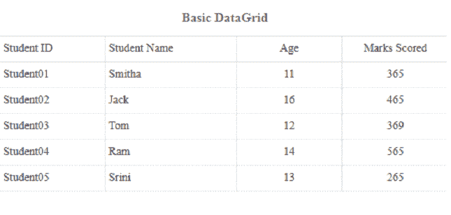
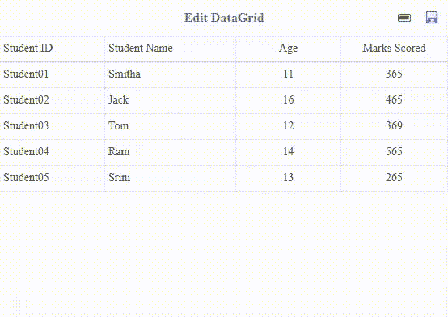
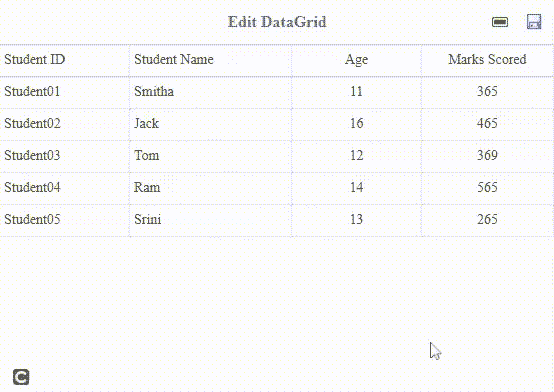

# 如何使用 jQuery 易 UI Mobile 编辑数据网格中的行？

> 原文:[https://www . geeksforgeeks . org/如何编辑数据网格中的行-使用-jquery-easyui-mobile/](https://www.geeksforgeeks.org/how-to-edit-rows-in-datagrid-using-jquery-easyui-mobile/)

[易用户](https://www.jeasyui.com/index.php)是一个 HTML5 框架，用于使用基于 jQuery、React、Angular 和 Vue 技术的用户界面组件。它有助于构建交互式 web 和移动应用程序的功能，为开发人员节省了大量时间。

在本文中，我们将学习使用 jQuery 易用户移动插件编辑数据网格的行。

**jQuery 易 UI 下载:**

```html
https://www.jeasyui.com/download/index.php
```

**示例 1:** 以下示例演示了使用 jQuery EasyUI Mobile 的基本数据网格。

## 超文本标记语言

```html
<!doctype html>
<html>

<head>
    <meta charset="UTF-8">
    <meta name="viewport" content="initial-scale=1.0, 
        maximum-scale=1.0, user-scalable=no">

    <!-- EasyUI specific stylesheets-->
    <link rel="stylesheet" type="text/css" 
        href="themes/metro/easyui.css">

    <link rel="stylesheet" type="text/css" 
        href="themes/mobile.css">

    <link rel="stylesheet" type="text/css" 
        href="themes/icon.css">

    <!--jQuery library -->
    <script type="text/javascript" src="jquery.min.js">
    </script>

    <!--jQuery libraries of EasyUI  -->
    <script type="text/javascript" 
        src="jquery.easyui.min.js">
    </script>

    <!--jQuery libraries of EasyUI Mobile-->
    <script type="text/javascript" 
        src="jquery.easyui.mobile.js">
    </script>
</head>

<body>
    <table id="tableID" data-options="header:'#headerID',
                        singleSelect:true,border:false,
                        fit:true,fitColumns:true,
                        scrollbarSize:0">
        <thead>
            <tr>
                <th data-options="field:'studentid',width:80">
                    Student ID
                </th>
                <th data-options="field:'studentname',
                    width:100">
                    Student Name
                </th>
                <th data-options="field:'age',
                    width:80,align:'center'">
                    Age
                </th>
                <th data-options="field:'marksscored',
                    width:80,align:'center'">
                    Marks Scored
                </th>
            </tr>
        </thead>
    </table>

    <div id="headerID">
        <div class="m-toolbar">
            <div class="m-title">
                Basic DataGrid
            </div>
        </div>
    </div>

    <script>
        var data = [
            {
                "studentid": "Student01", 
                  "studentname": "Smitha",
                "age": 11, "marksscored": 365
            },
            {
                "studentid": "Student02", 
                  "studentname": "Jack",
                "age": 16, "marksscored": 465
            },
            {
                "studentid": "Student03", 
                  "studentname": "Tom",
                "age": 12, "marksscored": 369
            },
            {
                "studentid": "Student04", 
                  "studentname": "Ram",
                "age": 14, "marksscored": 565
            },
            {
                "studentid": "Student05", 
                  "studentname": "Srini",
                "age": 13, "marksscored": 265
            }
        ];

        $(function () {

            /* Initialize datagrid */
            $('#tableID').datagrid({
                data: data
            });
        });
    </script>
</body>

</html>
```

**输出:**



**示例 2:** 以下示例演示了根据任意行的索引编辑和删除数据网格中的行。

## 超文本标记语言

```html
<!doctype html>
<html>

<head>
    <meta charset="UTF-8">
    <meta name="viewport" content="initial-scale=1.0, 
            maximum-scale=1.0, user-scalable=no">

    <!-- EasyUI specific stylesheets-->
    <link rel="stylesheet" type="text/css" 
        href="themes/metro/easyui.css">

    <link rel="stylesheet" type="text/css" 
        href="themes/mobile.css">

    <link rel="stylesheet" type="text/css" 
        href="themes/icon.css">

    <!--jQuery library -->
    <script type="text/javascript" 
        src="jquery.min.js">
    </script>

    <!--jQuery libraries of EasyUI  -->
    <script type="text/javascript" 
        src="jquery.easyui.min.js">
    </script>

    <!--jQuery libraries of EasyUI Mobile-->
    <script type="text/javascript" 
        src="jquery.easyui.mobile.js">
    </script>

</head>

<body>
    <table id="tableID" 
        data-options="
            header: '#headerID',
            singleSelect: true,
            border: false,
            fit: true,
            fitColumns: true,
            scrollbarSize: 0,
            iconCls: 'icon-edit',
            border: false,
            scrollbarSize: 0,
            data: data,
            onClickRow: onClickRow">

        <thead>
            <tr>
                <th data-options="
                    field: 'studentid',
                    width: 80">
                    Student ID
                </th>

                <!--editor:textbox is used for 
                    editing this field-->
                <th data-options="
                    field:' studentname',
                    width: 100,
                    editor: 'textbox'">
                    Student Name
                </th>

                <!--editor:numberbox is used 
                    for editing this field-->
                <th data-options="
                    field: 'age', width: 80,
                    align: 'center',
                    editor: 'numberbox'">
                    Age
                </th>

                <th data-options="
                    field: 'marksscored',
                    width: 80,
                    align: 'center',
                    editor: {
                        type: 'numberbox',
                        options: {precision:1}
                    }">
                    Marks Scored
                </th>
            </tr>
        </thead>
    </table>

    <div id="headerID">
        <div class="m-toolbar">
            <div class="m-title">
                Edit DataGrid
            </div>

            <div class="m-right">
                <a href="javascript:void(0)" 
                    class="easyui-linkbutton" 
                    data-options=
                    "iconCls: 'icon-remove', plain: true"
                    onclick="remove()">
                </a>

                <a href="javascript:void(0)" 
                    class="easyui-linkbutton" 
                    data-options=
                    "iconCls: 'icon-save', plain: true"
                    onclick="save()">
                </a>
            </div>
        </div>
    </div>

    <script>
        var data = [
            {
                "studentid": "Student01", 
                "studentname": "Smitha",
                "age": 11, "marksscored": 365
            },
            {
                "studentid": "Student02", 
                "studentname": "Jack",
                "age": 16, "marksscored": 465
            },
            {
                "studentid": "Student03", 
                "studentname": "Tom",
                "age": 12, "marksscored": 369
            },
            {
                "studentid": "Student04", 
                "studentname": "Ram",
                "age": 14, "marksscored": 565
            },
            {
                "studentid": "Student05", 
                "studentname": "Srini",
                "age": 13, "marksscored": 265
            }

        ];
        $(function () {
            $('#tableID').datagrid({
                data: data
            });
        });

        var editIndex = undefined;

        function endEditing() {
            if (editIndex == undefined) { return true }
            if ($('#tableID').datagrid('validateRow', editIndex)) {
                $('#tableID').datagrid('endEdit', editIndex);
                editIndex = undefined;
                return true;
            } else {
                return false;
            }
        }
        /* function called when one row is clicked*/
        function onClickRow(index) {
            if (editIndex != index) {
                if (endEditing()) {
                    $('#tableID').datagrid('selectRow', index)
                        .datagrid('beginEdit', index);
                    editIndex = index;
                }
                else {
                    $('#tableID').datagrid('selectRow', editIndex);
                }
            }
        }
        /* Delete function */
        function remove() {
            if (editIndex == undefined) { return }

            $('#tableID').datagrid('cancelEdit', editIndex)
                .datagrid('deleteRow', editIndex);
            editIndex = undefined;
        }
        /* Save function */
        function save() {
            if (endEditing()) {
                $('#tableID').datagrid('acceptChanges');
            }
        }
    </script>
</body>

</html>
```

**输出:**

**删除行:**



**更新行:**

