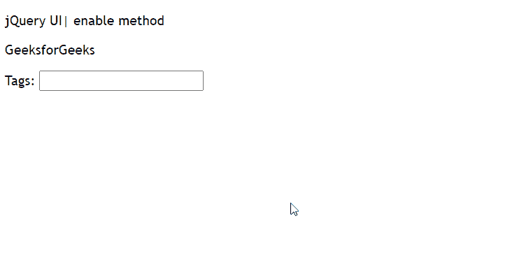

# 如何在 jQuery UI 中启用自动完成功能？

> 原文:[https://www . geeksforgeeks . org/如何启用 jquery-ui 中的自动完成功能/](https://www.geeksforgeeks.org/how-to-enable-an-autocomplete-in-jquery-ui/)

要在 jQuery 用户界面中启用自动完成，我们将使用 **enable()** 方法。jQuery UI **启用()**方法用于启用自动完成。它将手风琴式元素完全恢复到初始状态。

**语法:**

```html
$(".selector" ).autocomplete("enable")
```

**参数:**此方法不接受任何参数。

**返回值:**该方法只是将按钮返回到其初始前的状态。

**方法:**首先，添加项目所需的 jQuery UI 脚本。

> <src 脚本= " https://Ajax . Google APIs . com/Ajax/libs/jquery ui/1 . 8 . 16/jquery-ui . js "></script><link href = " http://Ajax . Google APIs . com/Ajax

**示例:**

## 超文本标记语言

```html
<!DOCTYPE html>
<html>

<head>
    <meta charset="utf-8">
    <meta name="viewport" content=
        "width=device-width, initial-scale=1">

    <script src=
"https://ajax.googleapis.com/ajax/libs/jquery/1.7.1/jquery.js">
    </script>

    <script src=
"https://ajax.googleapis.com/ajax/libs/jqueryui/1.8.16/jquery-ui.js">
    </script>

    <link href=
"http://ajax.googleapis.com/ajax/libs/jqueryui/1.8.16/themes/ui-lightness/jquery-ui.css"
        rel="stylesheet" type="text/css" />

    <style>
        .height {
            height: 10px;
        }
    </style>

    <script>
        $(function () {
            var list = [
                "One",
                "two",
                "Three",
                "Four",
            ];
            $("#gfg").autocomplete({
                source: list
            });
            $("#gfg").autocomplete("enable");
        });
    </script>
</head>

<body>
    <div class="ui-widget">
        <p>jQuery UI| enable method</p>
        <p>GeeksforGeeks</p>
        <label for="gfg">Tags: </label>
        <input id="gfg">
    </div>
</body>

</html>
```

**输出:**

