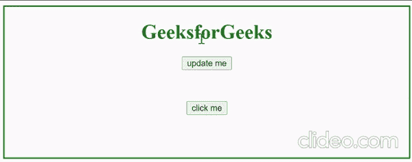

# 如何使用 jQuery 启用/禁用按钮？

> 原文:[https://www . geesforgeks . org/如何使用-jquery/](https://www.geeksforgeeks.org/how-to-enable-disable-a-button-using-jquery/) 启用-禁用按钮

在本文中，我们将演示如何使用 jQuery 启用和禁用按钮。本文需要对 HTML、CSS、JavaScript 和 jQuery 有一定的了解。jQuery [prop()](https://www.geeksforgeeks.org/jquery-prop-with-examples/) 功能可用于禁用按钮。

可以使用 **prop()** 方法显式检索属性值。 **prop()** 方法只返回集合中第一个匹配元素的属性值。对于尚未设置值的属性或不包含元素的匹配集，它将返回*未定义*。

**语法:**

使用此方法，可以将选定元素的布尔属性设置为*真*或*假*。

```html
$().prop(property, value) 
```

该函数返回一个布尔值。只要所选元素包含布尔属性(禁用，选中)，它就会返回 *true* 否则。

```html
$().prop(property)
```

**什么是禁用属性？**

这是一个布尔属性，指示不应显示该元素。使用被禁用的元素是不可用的。您可以设置 disabled 属性，以防止元素被使用，直到满足另一个条件(例如选中一个框)。

**示例:**点击下方按钮时，上方按钮禁用，双击下方按钮时，上方按钮启用。这个例子中应用了 prop 来演示如何正确使用它以及如何应用它。

## 超文本标记语言

```html
<!DOCTYPE html>
<html>

<head>
    <script src=
"https://cdnjs.cloudflare.com/ajax/libs/jquery/3.6.0/jquery.min.js">
    </script>
</head>

<body style="text-align: center; 
    border:2px solid green;
    min-height:240px;">

    <h1 style="color:green;">
        GeeksforGeeks
    </h1>

    <button id="update">
        update me
    </button>

    <div style="margin-top:50px;">
        <button id="change">
            click me
        </button>
    </div>

    <script>
        $('#change').on('click', function () {
            $('#update').prop('disabled', true);
        }
        );
        $('#change').on('dblclick', function () {
            $('#update').prop('disabled', false);
        });
    </script>
</body>

</html>
```

**输出:**



输出