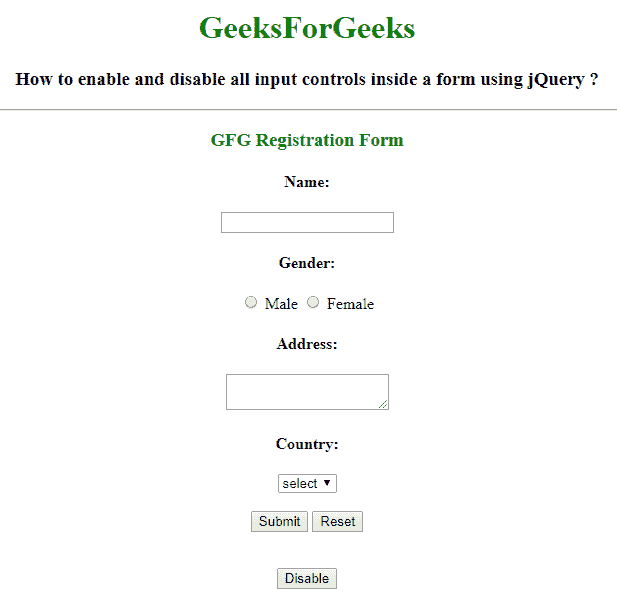
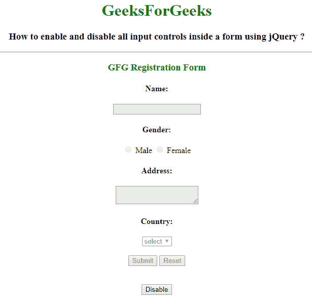
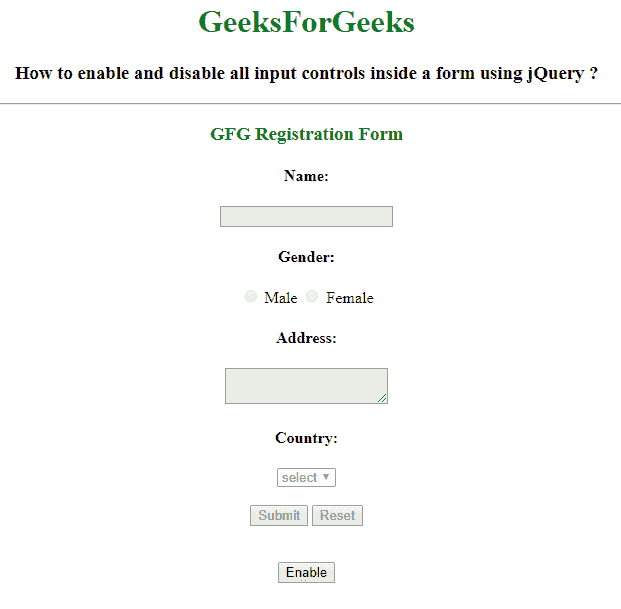
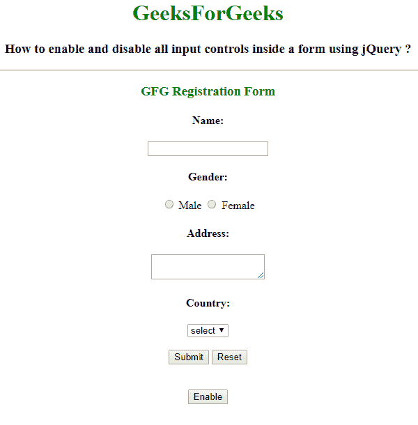

# 如何使用 jQuery 启用/禁用表单元素内的所有输入控件？

> 原文:[https://www . geesforgeks . org/如何启用-禁用-所有输入-控件-表单内-元素-使用-jquery/](https://www.geeksforgeeks.org/how-to-enable-disable-all-input-controls-inside-a-form-element-using-jquery/)

给出一个包含表单元素的 HTML 文档。表单元素包含输入元素、选项元素和按钮元素。使用 jQuery 启用或禁用窗体内所有输入控件的任务。可以使用 **prop()方法**来完成。

**使用 [prop()方法](https://www.geeksforgeeks.org/jquery-prop-with-examples/) :** 用于设置或返回所选元素的属性和值。

**语法:**

```
$(selector).prop( property, value )
```

**例 1:** 在本例中，**。prop()** 方法用于禁用表单元素内的所有输入控件。

```
<!DOCTYPE html>
<html>

<head>
    <title>
        How to enable and disable all input
        controls inside a form using jQuery?
    </title>

    <script src=
"https://code.jquery.com/jquery-1.12.4.min.js">
    </script>
</head>

<body style="text-align:center;">

    <h1 style = "color:green;" > 
        GeeksForGeeks 
    </h1> 

    <h3>
        How to enable and disable all input
        controls inside a form using jQuery ?
    </h3>
    <hr>

    <form id="GFG"> 
        <h3 style = "color:green;" >
            GFG Registration Form
        </h3>

        <label><h4>Name:</h4></label>
        <input type="text">

        <label><h4>Gender:</h4></label>

        <label><input type="radio" name="sex"> 
            Male
        </label>     

        <label><input type="radio" name="sex">
            Female
        </label>

        <label><h4>Address:</h4></label>

        <textarea></textarea>

        <label><h4>Country:</h4></label>

        <select>
            <option>select</option>
        </select>

        <br><br>

        <button type="button">Submit</button>
        <button type="button">Reset</button>
    </form>

    <br><br>

    <input onclick="enable_disable()" type="button"
                class="slide-toggle" value="Disable"
                id="myButton1">
    </input>

    <script type="text/javascript">
        function enable_disable() { 
            $("#GFG :input").prop("disabled", true);
        }
    </script>
</body>

</html>        
```

**输出:**

*   **之前点击按钮:**
    
*   **点击按钮后:**
    

**例 2:** 在本例中，**。prop()** 方法用于启用表单内的所有输入控件。

```
<!DOCTYPE html>
<html>

<head>
    <title>
        How to enable/disable all input controls
        inside a form using jQuery?
    </title>

    <script src=
"https://code.jquery.com/jquery-1.12.4.min.js">
    </script>
</head>

<body style="text-align:center;">

    <h1 style = "color:green;" > 
        GeeksForGeeks 
    </h1> 

    <h3>
        How to enable and disable all input 
        controls inside a form using jQuery ?
    </h3>
    <hr>

    <form id="GFG"> 
        <h3 style = "color:green;" >
            GFG Registration Form
        </h3>

        <label><h4>Name:</h4></label> <input type="text">

        <label><h4>Gender:</h4></label>
        <label><input type="radio" name="sex"> Male</label>     
        <label><input type="radio" name="sex"> Female</label>

        <label><h4>Address:</h4></label>
        <textarea></textarea>

        <label><h4>Country:</h4></label>
        <select>
            <option>select</option>
        </select>

        <br><br>

        <button type="button">Submit</button>
        <button type="button">Reset</button>
    </form>

    <br><br>

    <input onclick="enable_disable()" type="button"
            class="slide-toggle" value="Enable"
            id="myButton1">
    </input>

    <script type="text/javascript">
        $(document).ready(function() {
            $("#GFG :input").prop("disabled", true);
        });

        function enable_disable() { 
            $("#GFG :input").prop("disabled", false);
        }
    </script>
</body>

</html> 
```

**输出:**

*   **之前点击按钮:**
    
*   **点击按钮后:**
    

**示例 3:** 在本例中，启用和禁用表单内的所有输入控件是按顺序进行的。

```
<!DOCTYPE html>
<html>

<head>
    <title>
        How to enable and disable all input
        controls inside a form using jQuery ?
    </title>

    <script src=
"https://code.jquery.com/jquery-1.12.4.min.js">
    </script>
</head>

<body style="text-align:center;">

    <h1 style = "color:green;" > 
        GeeksForGeeks 
    </h1> 

    <h3>
        How to enable and disable all input 
        controls inside a form using jQuery ?
    </h3>
    <hr>

    <form id="GFG"> 
        <h3 style = "color:green;" >
            GFG Registration Form
        </h3>

        <label><h4>Name:</h4></label> <input type="text">

        <label><h4>Gender:</h4></label>
        <label><input type="radio" name="sex"> Male</label>     
        <label><input type="radio" name="sex"> Female</label>

        <label><h4>Address:</h4></label>
        <textarea></textarea>

        <label><h4>Country:</h4></label>
        <select>
            <option>select</option>
        </select>
        <br><br>

        <button type="button">Submit</button>
        <button type="button">Reset</button>
    </form>

    <br><br>

    <input onclick="enable_disable()" type="button"
                class="slide-toggle" value="Enable"
                id="myButton1">
    </input>

    <script type="text/javascript">
        $(document).ready(function() {
            $("#GFG :input").prop("disabled", true);
            $(".slide-toggle").click(function() {
                if (this.value=="Enable") {
                    this.value = "Disable";
                    $("#GFG :input").prop("disabled", false);
                }
                else {
                    this.value = "Enable";
                    $("#GFG :input").prop("disabled", true);
                }
            });
        });
    </script>
</body>

</html>
```

**输出:**

*   **之前点击按钮:**
    
*   **点击启用按钮后:**
    
*   **点击禁用按钮后:**
    