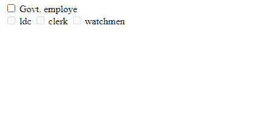
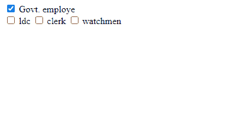
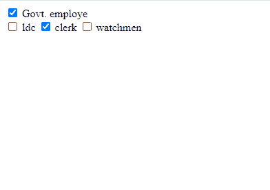

# 如何启用或禁用 jQuery 中的嵌套复选框？

> 原文:[https://www . geesforgeks . org/如何启用或禁用嵌套复选框-in-jquery/](https://www.geeksforgeeks.org/how-to-enable-or-disable-nested-checkboxes-in-jquery/)

在本文中，我们将看到如何在 jQuery 中启用或禁用嵌套复选框。为此，我们选择所有子复选框，并借助 jQuery 中的 **attr()** 方法向它们添加**禁用的**属性，以便所有复选框都将被禁用。

**语法:**

```html
// Select all child input of type checkbox
// with class child-checkbox
// And add the disabled attribute to them
$('.child-checkbox input[type=checkbox]')
    .attr('disabled', true);
```

之后，我们将一个点击事件监听器添加到父复选框，因此当我们点击父复选框时，如果它被选中，它的所有子复选框都将变为启用。否则，所有子复选框都将被禁用。

下面是该方法的实现:

**示例:**

## 超文本标记语言

```html
<!DOCTYPE html>
<html lang="en">

<head>
    <meta charset="utf-8">

    <title>
        How to enable or disable nested
        checkboxes in jQuery?
    </title>

    <!-- Link of JQuery cdn -->
    <script src=
"https://ajax.googleapis.com/ajax/libs/jquery/3.5.1/jquery.min.js">
    </script>
</head>

<body>
    <div class="container">
        <div class="parent-checkbox">
            <input type="checkbox"> Govt. employe
        </div>
        <div class="child-checkbox">
            <input type="checkbox"> ldc
            <input type="checkbox"> clerk
            <input type="checkbox"> watchmen
        </div>
    </div>

    <script>
        // Select child-checkbox classes all checkbox 
        // And add disabled attributes to them
        $('.child-checkbox input[type=checkbox]').
            attr('disabled', true);

        // When we check parent-checkbox then remove disabled
        // Attributes to its child checkboxes
        $(document).on('click', 
            '.parent-checkbox input[type=checkbox]',
            function (event) {

                // If parent-checkbox is checked add 
                // disabled attributes to its child
                if ($(this).is(":checked")) {
                    $(this).closest(".container").
                        find(".child-checkbox > 
                        input[type=checkbox]").
                        attr("disabled", false);
                } else {

                    // Else add disabled attrubutes to its 
                    // all child checkboxes  
                    $(this).closest(".container").
                        find(".child-checkbox > 
                        input[type=checkbox]").
                        attr("disabled", true);
                }
            });
    </script>
</body>

</html>
```

**输出:**

当父复选框禁用时:



当父复选框启用时:




<video class="wp-video-shortcode" id="video-521196-1" width="640" height="360" preload="metadata" controls=""><source type="video/mp4" src="https://media.geeksforgeeks.org/wp-content/uploads/20201201225230/bandicam-2020-12-01-22-51-44-481.mp4?_=1">[https://media.geeksforgeeks.org/wp-content/uploads/20201201225230/bandicam-2020-12-01-22-51-44-481.mp4](https://media.geeksforgeeks.org/wp-content/uploads/20201201225230/bandicam-2020-12-01-22-51-44-481.mp4)</video>