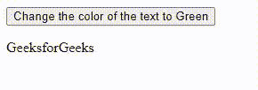

# 如何执行 jQuery 代码？

> 原文:[https://www.geeksforgeeks.org/how-to-execute-jquery-code/](https://www.geeksforgeeks.org/how-to-execute-jquery-code/)

jQuery 是一个开源的功能丰富的 Javascript 库，旨在简化 HTML DOM 树的遍历和操作、事件处理和 CSS 动画。它很受欢迎，因为它具有重量轻、速度快、体积小等特点，使用起来更方便。使用 jQuery 的目的是使 javascript 代码易于在网站上执行，因为 jQuery 将许多用 javascript 编写的代码行包装成一个可以用单行代码调用的方法。因此，许多需要 javascript 的常见任务都可以由 jQuery 来完成。

在本文中，我们将看到如何为我们的网页执行 jQuery 代码。执行 jQuery 代码相当容易，只需要注意几个步骤，然后我们就可以开始了。在跳到主题之前，我们将首先看看如何在网页中添加和使用 jQuery。有两种方法可以将 jQuery 添加到我们的网页/网站:

*   从[官方](https://jquery.com/download/)网站下载 jQuery 库
*   在线使用 jQuery [CDN 链接](https://code.jquery.com/)

让我们开始我们的第一个方法，即从网站下载库。

**方法一:下载 jQuery 库**

下载图书馆。出于开发和测试的目的，我们需要下载开发版本。其余版本是为了生产目的。一旦你点击[下载](https://jquery.com/download/)，它会带你到有可用链接的页面，点击需要的链接，然后右键点击页面&保存文件。注意，我们正在使用的文件是一个 javascript 文件，我们可以通过查看它的扩展名来检查它。现在，我们将看到如何将 jQuery 添加到我们的 HTML 文件中。确保 jQuery 文件必须放在工作区内。完成这许多步骤后，它将看起来像下图。

在标签部分的

```
<script src="jquery-3.6.0.min.js"></script>
```

**示例 1:** 创建一个 HTML 文件&将下面的代码添加到你的 HTML 文件中。

## 超文本标记语言

```
<!DOCTYPE html>
<html lang="en">

<head>
    <title>Document</title>
    <script src="jquery-3.6.0.min.js"></script>
</head>

<body>
    <p>GeeksforGeeks</p>
</body>

</html>
```

**输出:**

```
GeeksforGeeks
```

在上面的代码中，我们已经使用

**示例 2:** 在这个示例中，我们将编写一些 jQuery 代码，看看如何执行。

## 超文本标记语言

```
<!DOCTYPE html>
<html lang="en">

<head>
    <title>Document</title>
    <script src="jquery-3.6.0.min.js"></script>

    <!-- jQuery code starts from here, the 
        code will change the color of text
        when button is pressed -->
    <script>
        $(document).ready(function () {
            $("button").click(function () {
                $("p").css("color", "green");
            });
        });
    </script>

    <button>
        Change the color of the text to Green
    </button>
</head>

<body>
    <p>GeeksforGeeks</p>
</body>

</html>
```

**输出:**在本例中，我们已经编写了更改文本颜色的代码。要运行此代码，请在浏览器中打开此 HTML 文件。



通过下载 jQuery 文件

让我们进入下一个添加 jQuery ie 的方法，通过使用 jQuery CDN。

**方法二:使用 jQuery CDN 链接**

这种使用 jQuery 的方法相当简单，我们不需要下载任何东西，但是让我们简单了解一下 CDN。CDN 代表内容交付网络，基本上，它是一个面向不同类型网络服务的全球分布式服务器组，为互联网内容提供快速交付。例如，jQuery CDN 拥有与 jQuery 相关的所有必要信息，任何用户都可以随时从他们的服务器直接访问它。这种方法是相当可靠和更新的，为了与 jQuery 的 CDN 或任何其他库一起工作，我们必须与网络连接。现在让我们看看如何使用它。我们必须在我们的 HTML 文件中添加

**jQuery CDN 链接:**

**示例:**我们将在这里使用带有 jQuery CDN 链接的示例 2，以便查看变化。

## 超文本标记语言

```
<!DOCTYPE html>
<html lang="en">

<head>
    <title>Document</title>

    <!--jQuery CDN link-->
    <script src="https://code.jquery.com/jquery-3.6.0.min.js"
integrity="sha256-/xUj+3OJU5yExlq6GSYGSHk7tPXikynS7ogEvDej/m4=" 
        crossorigin="anonymous">
    </script>

    <!--jQuery code-->
    <script>
        $(document).ready(function () {
            $("button").click(function () {
                $("p").css("color", "green");
            });
        });
    </script>

    <button>
        Change the color of the text to Green
    </button>
</head>

<body>
    <p>GeeksforGeeks</p>
</body>

</html>
```

**输出:**


使用 jQuery CDN 链接

我们已经添加了 CDN 代码，现在我们准备再次使用 jQuery。这就是我们如何用一些简单的方法执行 jQuery。