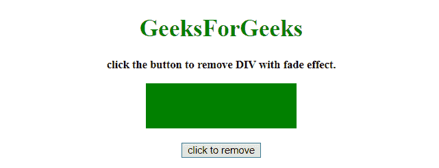
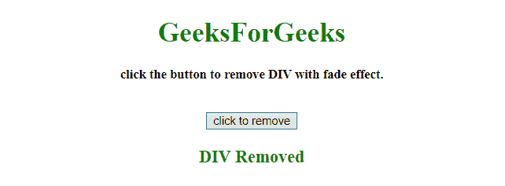

# 如何使用 jQuery 淡出和移除 div？

> 原文:[https://www . geesforgeks . org/how-to-fade out-and-remove-a-div-using-jquery/](https://www.geeksforgeeks.org/how-to-fadeout-and-remove-a-div-using-jquery/)

给定一个 div 元素。任务是使用 JQuery 用淡出效果移除它。这里讨论几个方法。
首先要知道的几个方法。

*   **jQuery text()方法:**
    该方法设置/返回所选元素的文本内容。
    如果使用此方法返回内容，则提供所有匹配元素的文本内容(HTML 标签将被移除)。
    如果用这个方法设置内容，它会替换所有匹配元素的内容。
    **语法:**
    *   **返回文字内容:**

        ```html
        $(selector).text()

        ```

    *   **设置文字内容:**

```html
$(selector).text(content)

```

*   **Set text content using a function:**

    ```html
    $(selector).text(function(index, curContent))

    ```

    **参数:**

    *   **内容:**此参数为必填项。它为选定的元素指定新的文本内容。
    *   **功能(索引，curContent):** 此参数可选。它指定了一个函数，为选定的元素返回新的文本内容。
        *   **索引:**返回元素在集合中的索引位置。
        *   **curContent:** 返回当前选中元素的内容。*   **jQuery Effect fadeOut() Method**
    This method gradually changes the opacity, for selected elements, from visible to hidden (fading effect).
    **Syntax:**

    ```html
    $(selector).fadeOut(speed, easing, callback)

    ```

    **参数:**

    *   **速度:**此参数为可选。它指定淡入淡出效果的速度。默认值= 400 毫秒。
        适用价值。
        *   **毫秒**
        *   **“慢”**
        *   **“快”**
    *   **放松:**此参数为可选。它指定了元素在动画不同点的速度。默认值=“摆动”。
        适用价值。
        *   **“挥杆”:**起步慢，中间快。
        *   **“线性”:**匀速运动。
    *   **回调:**此参数可选。它指定了 fadeOut()方法完成后要执行的功能。*   **jQuery on() Method**
    This method adds one or more event handlers for the selected elements and child elements.
    **Syntax:**

    ```html
    $(selector).on(event, childSelector, data, function, map)

    ```

    **参数:**

    *   **事件:**此参数为必填项。它指定一个或多个要附加到选定元素的事件或命名空间。
        如果有多个事件值，用空格隔开。事件必须是有效的。
    *   **儿童选择器:**该参数可选。它指定事件处理程序应该只附加到已定义的子元素。
    *   **数据:**此参数为可选。它指定要传递给函数的附加数据。
    *   **功能:**此参数为必选项。它指定事件发生时要运行的函数。
    *   **映射:**它指定了一个事件映射({event:func()，event:func()，…})，该事件映射有一个或多个要添加到所选元素的事件，以及事件发生时要运行的函数。*   **jQuery remove() Method**
    This method removes the selected elements, including all text and child nodes along with the data and events of the selected elements.
    **Syntax:**

    ```html
    $(selector).remove(selector)

    ```

    **参数:**

    *   **事件:**此参数可选。它指定要删除的一个或多个元素。使用逗号作为分隔符删除多个元素。

    **示例 1:** 在本示例中， **div 元素**在**淡出效果**持续 300 毫秒后被移除。

    ```html
    <!DOCTYPE HTML>
    <html>

    <head>
        <title>
            JQuery 
          | How to FadeOut and Remove a div.
        </title>
        <script src=
    "https://ajax.googleapis.com/ajax/libs/jquery/3.4.0/jquery.min.js">
        </script>
        <style>
            #div {
                height: 60px;
                width: 200px;
                background-color: green;
                margin: 0 auto;
            }
        </style>
    </head>

    <body style="text-align:center;" id="body">
        <h1 id="h" style="color:green;">  
                GeeksForGeeks  
            </h1>
        <p id="GFG_UP" 
           style="font-size: 15px; 
                  font-weight: bold;">
            click the button to remove DIV with fade effect.
        </p>
        <div id="div">
        </div>
        <br>
        <button>
            click to remove
        </button>
        <p id="GFG_DOWN" 
           style="color:green; 
                  font-size: 20px; 
                  font-weight: bold;">
        </p>
        <script>
            $('button').on('click', function(e) {
                $('#div').fadeOut(300, function() {
                    $('#div').remove();
                });
                $("#GFG_DOWN").text("DIV Removed");
            });
        </script>
    </body>

    </html>
    ```

    **输出:**

    *   **点击按钮前:**
        
    *   **点击按钮后:**
        

    **例 2:** 本例与前面类似。在本例中， **div 元素**在**淡出效果**300 毫秒后以不同的方式被移除。

    ```html
    <!DOCTYPE HTML>
    <html>

    <head>
        <title>
            JQuery 
          | How to FadeOut and Remove a div.
        </title>
        <script src=
    "https://ajax.googleapis.com/ajax/libs/jquery/3.4.0/jquery.min.js">
        </script>
        <style>
            #div {
                height: 60px;
                width: 200px;
                background-color: green;
                margin: 0 auto;
            }
        </style>
    </head>

    <body style="text-align:center;" 
          id="body">
        <h1 id="h" 
            style="color:green;">  
                GeeksForGeeks  
            </h1>
        <p id="GFG_UP" 
           style="font-size: 15px; font-weight: bold;">
            click the button to remove DIV with fade effect.
        </p>
        <div id="div">
        </div>
        <br>
        <button onclick='$("#div").fadeOut(300, function() 
                         { $(this).remove(); $("#GFG_DOWN")
                         .text("DIV Removed"); });'>
            click to remove
        </button>
        <p id="GFG_DOWN"
           style="color:green;
                  font-size: 20px; 
                  font-weight: bold;">
        </p>
    </body>

    </html>
    ```

    **输出:**

    *   **点击按钮前:**
        
    *   **点击按钮后:**
        