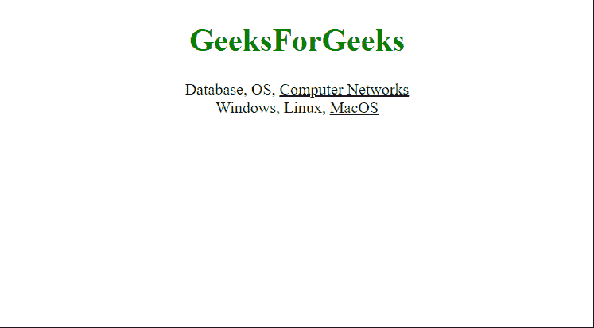

# 如何使用 jQuery 过滤任意元素的子元素？

> 原文:[https://www . geeksforgeeks . org/如何使用-jquery/](https://www.geeksforgeeks.org/how-to-filter-the-children-of-any-element-using-jquery/) 过滤任意元素的子元素

在本文中，我们将学习如何过滤 JQuery 中任何元素的子元素。 **JQuery** 是一个快速且轻量级的 JavaScript 库，它简化了 HTML/CSS 文档(更准确地说是文档对象模型(DOM))和 JavaScript 之间的交互。它以“少写多做”的座右铭而闻名这意味着您只需编写几行代码就可以完成所需的工作。

**方法:**我们只要选择合适的选择器就可以完成这个任务。例如，如果我们选择第一个子选择器，那么只有第一个子将被突出显示，如果我们选择最后一个子选择器，那么最后一个子将被突出显示。

子过滤器分为以下几类:

*   **第一个子元素选择器:**该选择器用于选择其父元素的第一个子元素。
*   **第一类型选择器:**该选择器用于选择相同元素名称的兄弟中第一个的所有元素。
*   **最后一个子元素选择器:**该选择器用于选择其父元素的最后一个子元素。
*   **最后一个类型选择器:**该选择器用于选择相同元素名称的同级中最后一个元素。
*   **第 n 个子()选择器:**该选择器用于选择其父元素的第 n 个子元素。
*   **第 n 个-最后一个子元素()选择器:**该选择器用于选择其父元素的所有第 n 个子元素，从最后一个元素到第一个元素计数。
*   **第 n 个最后一个类型()选择器:**该选择器用于选择所有元素，这些元素是其父元素相对于具有相同元素名称的兄弟元素的第 n 个子元素，从最后一个元素到第一个元素计数。
*   **第 n 个类型()选择器:**该选择器用于选择所有元素，这些元素是其父元素相对于具有相同元素名称的兄弟元素的第 n 个子元素。
*   **独生子选择器:**该选择器用于选择其父元素的所有独生子元素。
*   **仅类型选择器:**该选择器用于选择所有没有同名同宗的元素。

**示例 1:** 在本例中，我们将使用*第一个子元素选择器*来选择其父元素的第一个子元素。

## 超文本标记语言

```html
<!doctype html>
<html lang="en">

<head>
    <style>
        span {
            color: black;
        }

        span.thisgreen {
            color: green;
            font-weight: bolder;
        }

        body {
            text-align: center;
        }
    </style>
    <script src=
"https://code.jquery.com/jquery-3.5.0.js">
    </script>
</head>

<body>
    <h1 style="color:green">GeeksForGeeks</h1>

    <div>
        <span>Database,</span>
        <span>OS,</span>
        <span>Computer Networks</span>
    </div>
    <div>
        <span>Windows,</span>
        <span>Linux,</span>
        <span>MacOS</span>
    </div>

    <script>
        $("div span:first-child")
            .css("text-decoration", "underline")
            .hover(function () {
                $(this).addClass("thisgreen");
            }, function () {
                $(this).removeClass("thisgreen");
            });
    </script>
</body>

</html>
```

**输出:**


**示例 2:** 在本例中，我们将使用*最后一个子元素*选择器来选择其父元素的最后一个子元素。

## 超文本标记语言

```html
<!doctype html>
<html lang="en">

<head>
    <style>
        span {
            color: black;
        }

        span.thisgreen {
            color: green;
            font-weight: bolder;
        }

        body {
            text-align: center;
        }
    </style>
    <script src=
"https://code.jquery.com/jquery-3.5.0.js">
    </script>
</head>

<body>
    <h1 style="color:green">GeeksForGeeks</h1>

    <div>
        <span>Database,</span>
        <span>OS,</span>
        <span>Computer Networks</span>
    </div>
    <div>
        <span>Windows,</span>
        <span>Linux,</span>
        <span>MacOS</span>
    </div>

    <script>
        $("div span:last-child")
            .css("text-decoration", "underline")
            .hover(function () {
                $(this).addClass("thisgreen");
            }, function () {
                $(this).removeClass("thisgreen");
            });
    </script>
</body>

</html>
```

**输出:**

