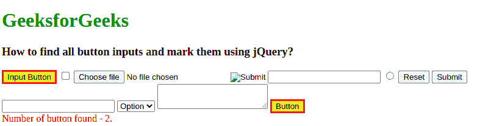

# 如何使用 jQuery 查找所有按钮输入并标记？

> 原文:[https://www . geesforgeks . org/how-to-find-all-button-inputs-and-mark-use-jquery/](https://www.geeksforgeeks.org/how-to-find-all-button-inputs-and-mark-them-using-jquery/)

jQuery 是一个小而快的 JavaScript 库，它的座右铭是:**“少写多做**”。要使用 jquery，您可以在本地机器上下载 jquery 库，或者在 HTML 代码中包含 JQuery 库。

请记住，在学习 JavaScript 之前，您已经对 HTML、CSS 和 JavaScript 有了基本的了解。

**注意:**在 jQuery 中，button 是一个扩展，不是 CSS 规范的一部分。您不能通过使用 jquery 按钮来利用本机 DOM querySelectorAll()方法提供的性能提升。

**为了获得更好的性能:**首先使用纯 CSS 选择器选择元素，然后使用 ***。滤镜(":按钮")*** 。

**方法:**在本文中，我们将学习如何找到所有按钮输入，并使用 javascript 标记它们。使用代码中的 ***:*** ***按钮选择器*** 来完成此任务。

*   **[:按钮选择器](https://www.geeksforgeeks.org/jquery-button-selector/) :** 用于选择类型按钮的所有按钮元素和元素。

**语法:**

```html
$(":button")
```

**示例:**

## 超文本标记语言

```html
<!DOCTYPE html>
<html lang="en">
    <head>
        <meta charset="utf-8" />
        <style>
            textarea {
                height: 35px;
            }
            div {
                color: red;
            }
            fieldset {
                margin: 0;
                padding: 0;
                border-width: 0;
            }
            .marked {
                background-color: yellow;
                border: 3px red solid;
            }
        </style>
        <script src=
"https://code.jquery.com/jquery-3.5.0.js">
        </script>
    </head>
    <body>
        <h1 style="color: green">GeeksforGeeks</h1>

        <h3>How to find all button inputs 
            and mark them using jQuery?
        </h3>
        <form>
            <fieldset>
                <input type="button" 
                       value="Input Button" />
                <input type="checkbox" />

                <input type="file" />
                <input type="hidden" />
                <input type="image" />

                <input type="password" />
                <input type="radio" />
                <input type="reset" />

                <input type="submit" />
                <input type="text" />
                <select>
                    <option>Option</option>
                </select>

                <textarea></textarea>
                <button>Button</button>
            </fieldset>
        </form>
        <div></div>

        <script>
            var input = $(":button").addClass("marked");
            $("div").text("Number of button found - " + input.length + ".");
            // Prevent the form from submitting
            $("form").submit(function (event) {
                event.preventDefault();
            });
        </script>
    </body>
</html>
```

**输出:**可以注意到所有的按钮输入都做了标记。

