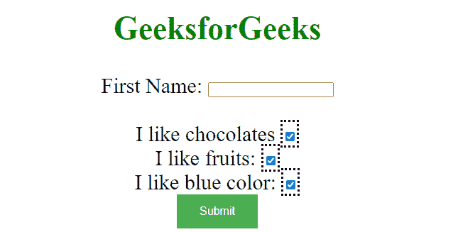

# 如何使用 jQuery 查找所有复选框输入？

> 原文:[https://www . geeksforgeeks . org/如何找到所有复选框-输入-使用-jquery/](https://www.geeksforgeeks.org/how-to-find-all-checkbox-inputs-using-jquery/)

任务是使用 jQuery 查找所有的复选框输入。复选框是在激活时勾选的方形框，用于选择一个或多个选项。

**使用的方法和选择器:**

*   **:checbox** :该选择器用于选择 [*类型=复选框*](https://www.geeksforgeeks.org/html-input-typecheckbox/) 的输入元素。
*   [**。wrap()**](https://www.geeksforgeeks.org/jquery-wrap-with-examples/) **:** 此方法用于指定每个选定元素周围的 HTML 元素。

**进场:**

*   使用输入[类型复选框](https://www.geeksforgeeks.org/html-input-typecheckbox/)创建 HTML 页面。
*   使用复选框选择器，您可以使用类型复选框选择所有输入。
*   在*的帮助下。wrap()* 方法，可以对那些选中的项目进行样式化。

**示例:**

## 超文本标记语言

```
<!DOCTYPE html>
<html>
  <head>
    <script src=
"https://ajax.googleapis.com/ajax/libs/jquery/3.5.1/jquery.min.js">
    </script>
    <style>
      body {
        text-align: center;
        font-size: 30px;
      }
      button {
        background-color: #4caf50; /* Green */
        border: none;
        color: white;
        padding: 15px 32px;
        text-align: center;
        text-decoration: none;
        display: inline-block;
        font-size: 16px;
      }
    </style>

    <script>
      $(document).ready(function () {
        $(":checkbox").wrap("<span style='border-style:dotted'>");
      });
    </script>
  </head>
  <body>
    <h2 style="color: green">GeeksforGeeks</h2>

    <form action="">
      First Name: <input type="text" name="user" />
      <br />
      <br />I like chocolates
      <input type="checkbox" name="chocolate" 
             value="chocolate" /><br />
      I like fruits:
      <input type="checkbox" 
             name="fruits" value="fruits" />
      <br />
      I like blue color:
      <input type="checkbox" 
             name="color" value="color" />
      <br />
      <button>Submit</button>
    </form>
  </body>
</html>
```

**输出:**



检验盒