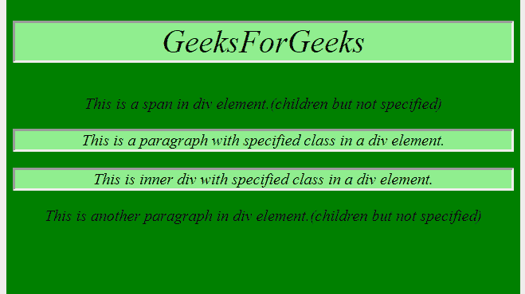
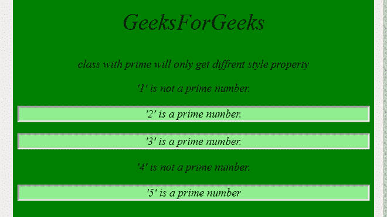

# 如何使用 jQuery 查找指定类的所有孩子？

> 原文:[https://www . geeksforgeeks . org/如何使用-jquery/](https://www.geeksforgeeks.org/how-to-find-all-children-with-a-specified-class-using-jquery/) 找到指定类别的所有儿童

有很多 javascript 库，如–anime . js、screenfull.js、moment.js 等。JQuery 也是 javascript 库的一部分。它用于简化代码。这是一个轻量级且功能丰富的库。

在这篇文章中，我们将学习如何找到每个部门指定班级的所有孩子。

**。子级(选择器)–**在 jquery 中，您可以使用名为 ***的方法来完成此任务。**儿童()*。它将选择器作为参数，并使用指定的名称更改子元素。

**例 1:**

## 超文本标记语言

```html
<!DOCTYPE html>
<html>

<head>
    <script src="https://code.jquery.com/jquery-git.js">
    </script>

    <style>
        body {
            font-size: 20px;
            font-style: italic;
            background-color: green;
            text-align: center;
        }
    </style>
</head>

<body>
    <div>
        <h1 class="child">
            GeeksForGeeks
        </h1>

        <span>
            This is a span in div element.
            (children but not specified)
        </span>

        <p class="child">
            This is a paragraph with specified
            class in a div element.
        </p>

        <div class="child">
            This is inner div with specified
            class in a div element.
        </div>

<p>
            This is another paragraph in div
            element.(children but not specified)
        </p>

    </div>

    <script>
        $("div").children(".child").css({
            "background-color": "lightgreen",
            "border-style": "inset"
        });
    </script>
</body>

</html>
```

**输出:**



**说明:**div 元素有 5 个子元素(1 个标题、1 个跨度、1 个内部 div 和 3 个段落)。在代码中，我们用 class =“child”指定了三个元素，即两段和一个 div。您可以注意到，只有指定的元素会受到影响并更改其样式属性。

**例 2:**

## 超文本标记语言

```html
<!DOCTYPE html>
<html>

<head>
    <script src=
"https://code.jquery.com/jquery-git.js">
    </script>

    <style>
        body {
            font-size: 20px;
            font-style: italic;
            background-color: green;
            text-align: center;
        }
    </style>
</head>

<body>
    <div>
        <h1>GeeksForGeeks</h1>

<p>
            class with prime will only
            get different style property
        </p>

<p>'1' is not a prime number.</p>

        <p class="prime">'2' is a prime number.</p>

        <div class="prime">'3' is a prime number.</div>

<p>'4' is not a prime number.</p>

        <p class="prime">'5' is a prime number</p>

    </div>

    <script>
        $("div").children(".prime").css({
            "background-color": "lightgreen",
            "border-style": "inset"
        });
    </script>
</body>

</html>
```

**输出–**

