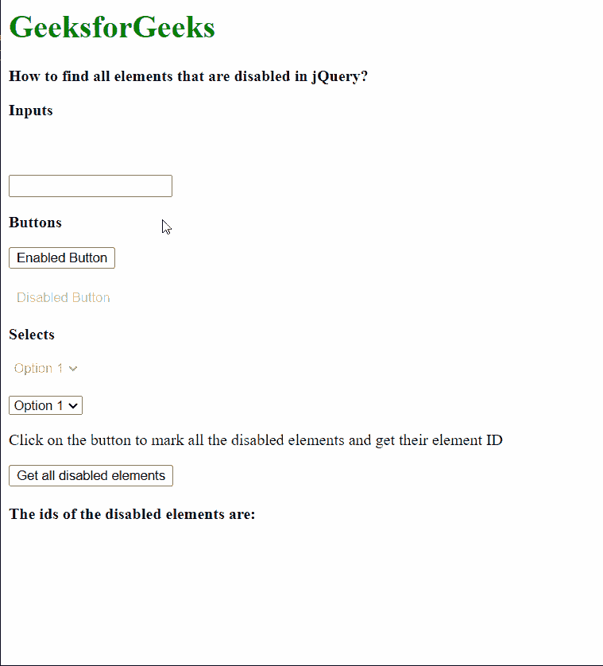

# 如何查找 jQuery 中所有被禁用的元素？

> 原文:[https://www . geeksforgeeks . org/如何在 jquery 中查找所有禁用的元素/](https://www.geeksforgeeks.org/how-to-find-all-elements-that-are-disabled-in-jquery/)

在本文中，我们将学习如何使用 jQuery 查找页面上所有被禁用的元素。

**方法:****:禁用**选择器可用于获取页面上当前禁用的所有元素。使用**每()**方法迭代这些元素。然后，可以在每个()方法的功能中使用*这个*引用来单独访问元素。

可以通过在禁用的选择器前面指定元素的类型来选择特定类型的元素，否则如果页面上的所有元素被禁用，则会对其进行检查。例如，使用“输入:禁用”将仅选择属于*输入*类型的禁用元素。

**语法:**

```html
$(".btn").click(function () {

    let disabled_elems = "";

    // Get all the disabled elements
    $(":disabled").each(function (index) {

        // Add a border to the elements
        $(this).css("border", "10px red dashed");

        // Add the IDs to the list
        disabled_elems += "<li>" 
            + ($(this).attr("id")) + "</li>";
    });

    $(".elems").html(disabled_elems);
});

```

以下示例说明了上述方法:

**示例:**

## 超文本标记语言

```html
<!DOCTYPE html>
<html>

<head>
    <script src=
"https://code.jquery.com/jquery-3.3.1.min.js">
    </script>
</head>

<body>
    <h1 style="color: green">
        GeeksforGeeks
    </h1>

    <b>
        How to find all elements that
        are disabled in jQuery?
    </b>

    <!-- Define some elements with 
        the disabled attribute -->
    <p><b>Inputs</b></p>

    <input type="text" id="inp1" disabled />
    <br><br>
    <input type="text" id="inp2" />

    <p><b>Buttons</b></p>

    <button type="button" id="btn1">
        Enabled Button
    </button>
    <br><br>

    <button type="button" id="btn2" disabled>
        Disabled Button
    </button>

    <p><b>Selects</b></p>

    <select id="select1" disabled>
        <option value="opt1">Option 1</option>
    </select>
    <br><br>

    <select id="select2">
        <option value="opt1">Option 1</option>
    </select>
    <br>

    <p>
        Click on the button to mark all
        the disabled elements and
        get their element ID
    </p>

    <button class="btn">
        Get all disabled elements
    </button>
    <br><br>

    <b>The ids of the disabled elements are:</b>
    <ul class="elems"></ul>

    <script>
        $(".btn").click(function () {

            let disabled_elems = "";

            // Get all the disabled elements
            // using the :disabled selector
            $(":disabled").each(function (index) {

                // Add a border to the elements
                $(this).css(
                    "border", "10px red dashed"
                );

                // Add the IDs to the list
                disabled_elems += "<li>" 
                    + ($(this).attr("id")) + "</li>";
            });

            $(".elems").html(disabled_elems);
        });
    </script>
</body>

</html>
```

**输出:**

