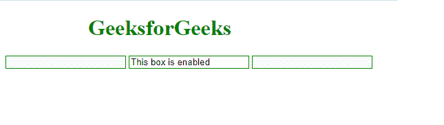

# 如何找到所有使用 jQuery 启用的输入元素？

> 原文:[https://www . geeksforgeeks . org/如何使用-jquery/](https://www.geeksforgeeks.org/how-to-find-all-input-elements-that-are-enabled-using-jquery/) 查找所有启用的输入元素

jQuery[*":enabled "*](https://www.geeksforgeeks.org/css-enabled-selector/)伪类选择器帮助找到所有*启用的*输入元素。这个伪类选择器应该只用于选择支持*禁用*属性的 HTML 元素，即( [*<按钮>*](https://www.geeksforgeeks.org/html-button-tag/)*[*<输入>*](https://www.geeksforgeeks.org/html-input-tag/)*[*<文本区>*](https://www.geeksforgeeks.org/html-textarea-tag/) *、<选择>、***

**与其他伪类选择器一样，如 [(a:悬停)](https://www.geeksforgeeks.org/how-to-write-ahover-in-inline-css/)也建议在它前面加上标签名或其他选择器**、**，否则通用选择器(“ ***** ”)隐含如[$(“*:enabled”)](https://www.geeksforgeeks.org/css-enabled-selector/)或$(“input:enabled”)。**

****语法:****

```html
**$( "input:enabled" ).val( "This box is enabled" );**
```

****注意:** (:enabled)选择严格地将*布尔*禁用属性*设置为 false 的元素。***

****HTML 代码:**下面的代码演示了*:启用*伪类选择器来查找所有使用 jQuery 启用的输入元素。**

## **超文本标记语言**

```html
**<!doctype html>
<html lang="en">
<head>
    <meta charset="utf-8">
    <meta http-equiv="X-UA-Compatible" content="IE=edge">
    <meta name="viewport" content="width=device-width, initial-scale=1.0">
    <title>Elements that are enabled</title>
    <script src="https://code.jquery.com/jquery-3.5.0.js"></script>
</head>
<body>

    <h1 style="color: green; margin-left: 120px;">GeeksforGeeks</h1>

    <!-- The form contains three boxes out 
         of which two boxes are disabled -->

    <form>
        <!-- Set input disabled -->
        <input style="border: 0.8px solid green;" name="email" disabled>
        <input style="border: 0.8px solid green;" name="id">
        <input style="border: 0.8px solid green;" name="email" disabled>
    </form>

    <!-- The val is displayed in the box in
          which the input element is enabled -->

    <script>
        $( "input:enabled" ).val( "This box is enabled" );
    </script>

</body>
</html>**
```

****输出:****

**

使能够**