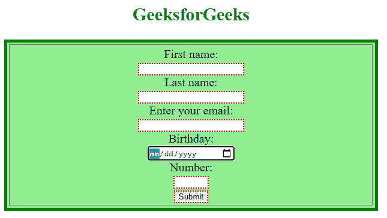

# 如何在 jQuery 中找到所有是表单后代的输入，并用红色虚线边框标记出来？

> 原文:[https://www . geeksforgeeks . org/如何找到表单的所有输入后代，并在 jquery 中用红色虚线边框标记它们/](https://www.geeksforgeeks.org/how-to-find-all-inputs-that-are-descendants-of-a-form-and-mark-them-with-a-dotted-red-border-in-jquery/)

任务是找到作为表单后代(子代或孙代)的所有输入，并使用 jQuery 用红色虚线框标记它们。

**使用的方法和选择器:**

1.  [parent descendant selector](https://www.geeksforgeeks.org/jquery-parent-descendant-selector/): This selector is used to select all elements that are descendants of a specified element.

    **语法:**

    ```html
    ("parent descendant")
    ```

2.  [css()方法:](https://www.geeksforgeeks.org/jquery-css-method/)此方法用于设置或返回所选元素的一个或多个样式属性。

**进场:**

*   使用表单元素及其组件(如[字段集](https://www.geeksforgeeks.org/html5-fieldset-tag/)或输入等)创建 HTML 页面。
*   使用*父代子代*选择器选择表单元素的输入。
*   最后，应用一些 CSS 样式来显示适当的结果。

**示例:**

## 超文本标记语言

```html
<!DOCTYPE html>
  <html>
  <head>
  <script src=
"https://code.jquery.com/jquery-git.js">
  </script>
  <meta charset="utf-8">
  <meta name="viewport" 
        content="width=device-width">

  <style>
      body{
          text-align:center;
          font-size:20px;
      }
     form {
        border: 5px green solid;
        padding: 2px;
        margin: 0;
        background: lightgreen;
     }
    div {
      color: red;
     }
    fieldset {
        margin: 1px;
        padding: 3px;
    }

  </style>
  </head>
  <body>
      <h2 style="color:green">GeeksforGeeks</h2>
  <form >
  <fieldset>

     <label for="fname">
       First name:</label>
     <br>
     <input type="text" id="fname" 
            name="fname" value="">
     <br>
     <label for="lname">
       Last name:</label>
     <br>
     <input type="text" id="lname" 
            name="lname" value="">
     <br>
     <label for="email">
       Enter your email:</label>
     <br>
     <input type="email" id="email" 
            name="email">
     <br>
     <label for="birthday">
       Birthday:</label>
     <br>
     <input type="date" id="birthday" 
            name="birthday">
     <br>
     <label for="quantity">
        Number:</label>
     <br>
     <input type="number" id="quantity" 
            name="quantity" min="1" max="5">
     <br>
     <input type="submit" value="Submit">
  </fieldset>
  </form>  

  <script>
      $( "form input" ).css( "border", "2px dotted red");
  </script>
  </body>
  </html>
```

**输出:**

