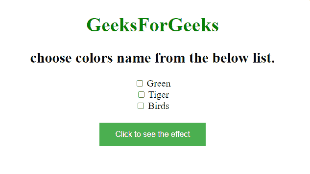
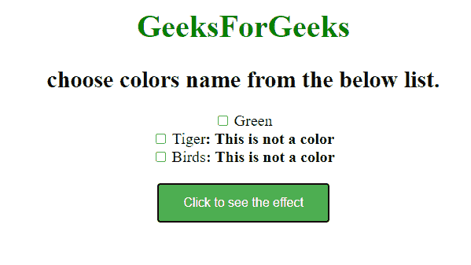

# 如何使用 jQuery 查找所有没有颜色名称的输入，并将文本追加到其旁边的跨度？

> 原文:[https://www . geeksforgeeks . org/如何使用-jquery/](https://www.geeksforgeeks.org/how-to-find-all-inputs-that-dont-have-color-name-and-appends-text-to-the-span-next-to-it-using-jquery/) 找到所有没有颜色名称和附加文本的输入

给定一些输入元素，任务是找到所有没有 name = "color "的输入，并使用 jQuery 将文本追加到它旁边的跨度。简单来说，我们要找到所有有名字的输入！= "color "然后我们必须在 span 元素旁边附加一些文本。

**使用方法:**

*   **next()方法:**此方法用于返回所选元素的下一个同级元素。
*   **append()方法:**该方法用于在选中元素的末尾插入指定内容。

**进场:**

*   用不同的输入名称创建一个网页，并且至少有一个名称应该是彩色的。
*   接下来选择没有 name = "color "的输入。
*   在每个没有 name = "color "的 span 元素后写一条消息。

**示例:**

## 超文本标记语言

```
<!DOCTYPE html>
<html>

<head>
    <script 
src="https://code.jquery.com/jquery-git.js">
    </script>

    <style type="text/css">
        body {
            text-align: center;
            font-size: 20px;
        }

        button {
            background-color: #4CAF50;
            /* Green */
            border: none;
            color: white;
            padding: 15px 32px;
            text-align: center;
            text-decoration: none;
            display: inline-block;
            font-size: 16px;
        }
    </style>
</head>

<body>
    <h1 style="color:green;">GeeksForGeeks</h1>
    <h2>choose colors name from the below list.</h2>
    <div>
        <input type="checkbox" name="color" value="Red">
        <span>Green</span>
    </div>
    <div>
        <input type="checkbox" name="animal" value="good">
        <span>Tiger</span>
    </div>
    <div>
        <input type="checkbox" name="birds" value="fly">
        <span>Birds</span>
    </div>
    <br>
    <button id="button1">Click to see the effect</button>

    <script>
        $('#button1').click(function() {
            $("input[name!='color']").next()
              .append("<b>: This is not a color</b>");
        });
    </script>
</body>

</html>
```

**输出–**

**点击按钮前–**



**点击按钮后–**

