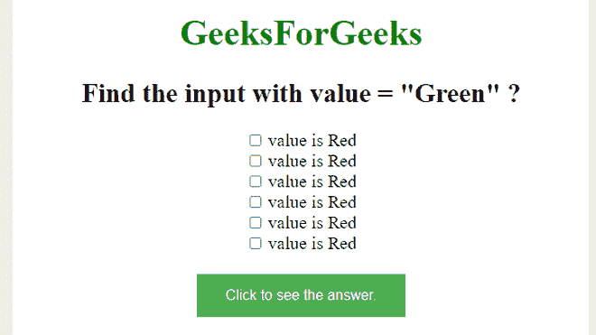
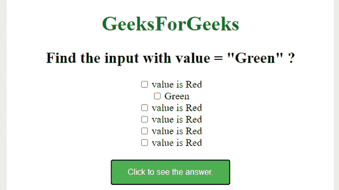

# 如何使用 jQuery 找到所有值为绿色的输入，并更改下一个同级跨度的文本？

> 原文:[https://www . geeksforgeeks . org/如何使用-jquery/](https://www.geeksforgeeks.org/how-to-find-all-inputs-with-a-value-green-and-change-the-text-of-next-sibling-span-using-jquery/) 查找带有绿色值的所有输入并更改下一个同级跨度的文本

本文的目的是找到值为“绿色”的所有输入，并使用 jQuery 更改下一个同级跨度的文本。

**使用的方法–**

**[next()方法](https://www.geeksforgeeks.org/jquery-next-nextall-with-examples/)–**该方法用于返回所选元素的下一个同级元素。

**[text()方法](https://www.geeksforgeeks.org/jquery-text-method/)–**该方法用于返回所选元素的文本内容。

**进场–**

*   创建一个带有不同颜色名称的输入值的网页。
*   找到值为“绿色”的输入，并更改其下一个同级范围的文本。

**示例–**

## 超文本标记语言

```html
<!DOCTYPE html>
<html>

<head>
    <style type="text/css">
        body {
            text-align: center;
            font-size: 20px;
        }

        button {
            background-color: #4CAF50;
            /* Green */
            border: none;
            color: white;
            padding: 15px 32px;
            text-align: center;
            text-decoration: none;
            display: inline-block;
            font-size: 16px;
        }
    </style>
</head>

<body>
    <h1 style="color:green"> GeeksForGeeks</h1>
    <h2>Find the input with value = "Green" ?</h2>
    <div>
        <form>
            <input type="checkbox" value="Red">
            <span>value is Red</span><br>
            <input type="checkbox" value="Green">
            <span>value is Red</span><br>
            <input type="checkbox" value="Red">
            <span>value is Red</span><br>
            <input type="checkbox" value="Red">
            <span>value is Red</span><br>
            <input type="checkbox" value="Red">
            <span>value is Red</span><br>
            <input type="checkbox" value="Red">
            <span>value is Red</span><br>
        </form>
    </div>
    <br>
    <button>Click to see the answer.</button>
    <script>
        $('button').click(function() {
            $("input[value='Green']").next().text(" Green ");
        });
    </script>
</body>

</html>
```

**输出–**

**点击按钮前–**



**点击按钮后–**

