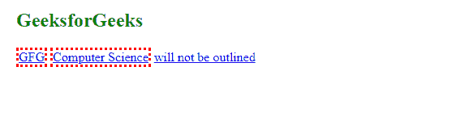
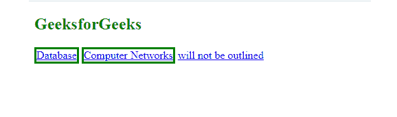

# 如何使用 jQuery 找到所有带有 hreflang 属性的链接？

> 原文:[https://www . geeksforgeeks . org/how-to-find-all-link-with-hreflang-attribute-use-jquery/](https://www.geeksforgeeks.org/how-to-find-all-links-with-an-hreflang-attribute-using-jquery/)

在本文中，我们将学习查找所有带有 *hreflang* 属性的链接。 *hreflang* 是一个属性，它告诉搜索引擎你网站上不同语言页面之间的关系。

您可以通过以下三种方式使用该属性。

*   作为网页 HTML 头部的链接()。
*   在 HTTP 头中(示例 pdf)
*   在 XML 网站地图上

您可以使用*属性包含前缀*选择器在页面上找到所有带有 hreflang 属性的链接。

***属性包含前缀*** **选择器:**该选择器用于选择具有指定属性的元素，该属性的值等于给定字符串或以该字符串开头。

**语法:**

```
jQuery( "[attribute|='value']" )

$( "a[hreflang|='en']" ) 
```

**示例 1:** 在下面的示例中，我们首先找到 *hreflang* ，然后使用 CSS 属性将其高亮显示。值为“en”的 *hreflang* 属性用红色虚线边框突出显示。

## 超文本标记语言

```
<!doctype html>
<html lang="en">
<head>
  <meta charset="utf-8">
  <style>
  a {
    display: inline-block;
  }
  </style>
  <script src=
"https://code.jquery.com/jquery-3.5.0.js">
  </script>
</head>
<body>
  <h2 style="color:green">GeeksforGeeks</h2>
  <a href="example.html" hreflang="en">GFG</a>
  <a href="example.html" hreflang="en-UK">
     Computer Science
  </a>
  <a href="example.html" hreflang="english">
     will not be outlined
  </a>

  <script>
    $( "a[hreflang|='en']" )
    .css( "border", "3px dotted red" );
  </script>

</body>
</html>
```

**输出:**



href lang = en

**例 2:**

## 超文本标记语言

```
<!doctype html>
<html lang="en">
<head>
  <meta charset="utf-8">
  <style>
  a {
    display: inline-block;
  }
  </style>
  <script src=
"https://code.jquery.com/jquery-3.5.0.js"></script>
</head>
<body>
  <h2 style="color:green">GeeksforGeeks</h2>
  <a href="example.html" hreflang="en">Database</a>
  <a href="example.html" hreflang="en-UK">
    Computer Networks
  </a>
  <a href="example.html" hreflang="english">
    will not be outlined
  </a>

  <script>
    $( "a[hreflang|='en']" )
    .css( "border", "3px solid green" );
  </script>

</body>
</html>
```

**输出:**



hreflag=en 第 2 帧