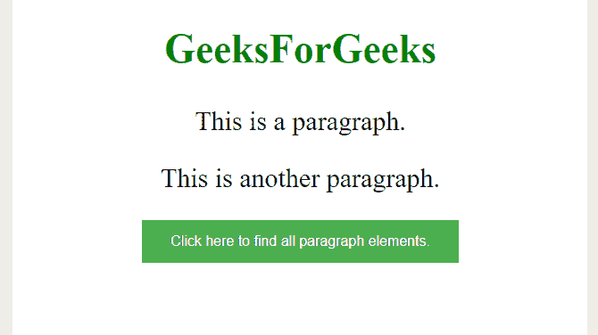
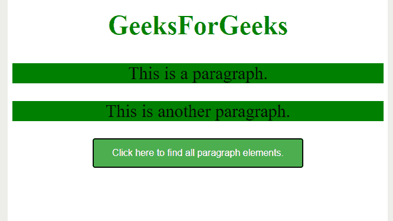
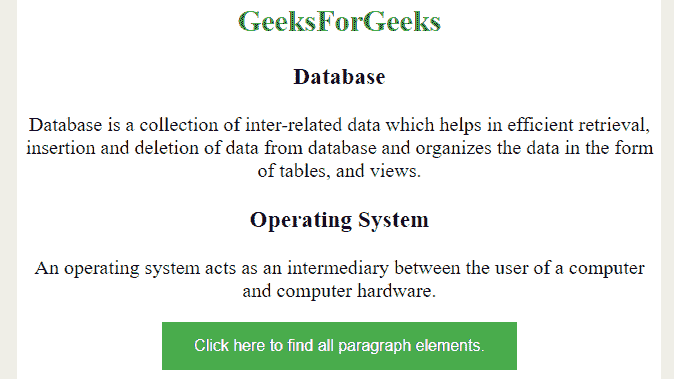
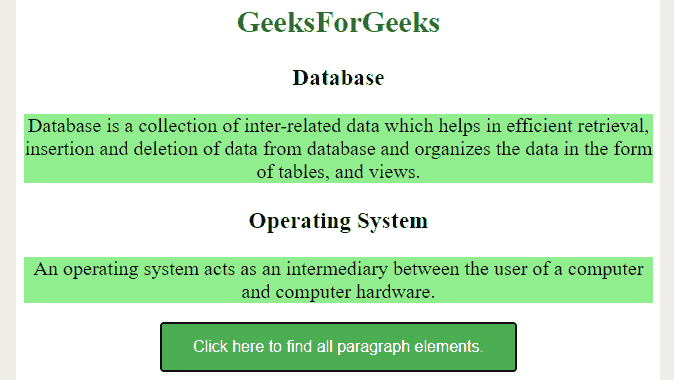

# 如何使用 jQuery 查找所有段落元素？

> 原文:[https://www . geeksforgeeks . org/如何使用-jquery/](https://www.geeksforgeeks.org/how-to-find-all-paragraph-elements-using-jquery/) 查找所有段落元素

给定一个包含段落元素的网页，任务是使用 jQuery 模块找到每个段落元素。我们要从 HTML 页面中找到 [*< p >*](https://www.geeksforgeeks.org/html-paragraph/) 元素，使用元素选择器就可以实现这个任务。元素选择器将根据元素的名称选择元素。

**语法:**

```html
$("element name")
```

**进场:**

*   首先创建一个 HTML 页面，并在

    元素中写入一些内容。

*   在 jQuery 的帮助下，选择所有的段落元素。
*   对 *< p >* 元素应用一些 CSS 属性来查看变化。你可以用 [*。css()*](https://www.geeksforgeeks.org/jquery-css-method/) 方法应用 css 属性。

**例 1:**

## 超文本标记语言

```html
<!DOCTYPE html>
<html>

<head>
    <script src=
"https://ajax.googleapis.com/ajax/libs/jquery/3.5.1/jquery.min.js">
    </script>

    <style>
        body {
            text-align: center;
            font-size: 30px;
        }

        button {
            background-color: #4CAF50;
            /* Green */
            border: none;
            color: white;
            padding: 15px 32px;
            text-align: center;
            text-decoration: none;
            display: inline-block;
            font-size: 16px;
        }
    </style>

    <script>
        $(document).ready(function () {
            $("button").click(function () {
                $("p").css("background-color", "green");
            });
        });
    </script>
</head>

<body>

    <h2 style="color:green">
        GeeksForGeeks
    </h2>

    <p>This is a paragraph.</p>

    <p>This is another paragraph.</p>

    <button>
        Click here to find all 
        paragraph elements.
    </button>
</body>

</html>
```

**输出:**

*   **点击按钮前:**



*   **点击按钮后:**



**说明:**从上面的例子可以注意到，点击按钮后，每个段落元素的背景颜色都变了。使用选择器，我们已经选择了所有的段落元素，然后使用 [*。方法来设置所有段落元素的样式。*](https://www.geeksforgeeks.org/jquery-css-method/)

**例 2:**

## 超文本标记语言

```html
<!DOCTYPE html>
<html>

<head>
    <script src=
"https://ajax.googleapis.com/ajax/libs/jquery/3.5.1/jquery.min.js">
    </script>

    <style>
        body {
            text-align: center;
            font-size: 20px;
        }

        button {
            background-color: #4CAF50;
            /* Green */
            border: none;
            color: white;
            padding: 15px 32px;
            text-align: center;
            text-decoration: none;
            display: inline-block;
            font-size: 16px;
        }
    </style>

    <script>
        $(document).ready(function () {
            $("button").click(function () {
                $("p").css("background-color", "lightgreen");
            });
        });
    </script>
</head>

<body>
    <h2 style="color:green">
        GeeksForGeeks
    </h2>

    <h3>Database</h3>

    <p> 
        Database is a collection of inter-related 
        data which helps in efficient retrieval,
        insertion and deletion of data from 
        database and organizes the data in the 
        form of tables, views
    </p>

    <h3>Operating System</h3>

    <p>
        An operating system acts as an intermediary 
        between the user of a computer and computer 
        hardware.
    </p>

    <button>
        Click here to find all 
        paragraph elements.
    </button>
</body>

</html>
```

**输出:**

*   **点击按钮前:**



*   **点击按钮后:**

