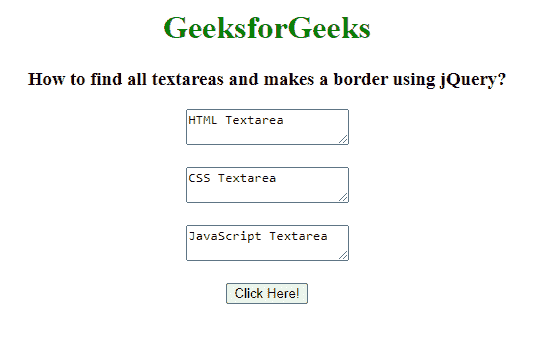
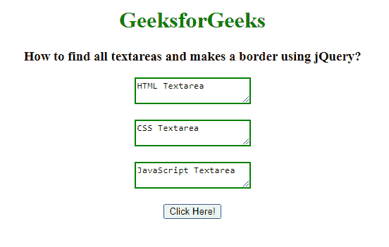

# 如何使用 jQuery 查找所有文本区域并制作边框？

> 原文:[https://www . geeksforgeeks . org/如何使用 jquery 找到所有文本区域并制作边框/](https://www.geeksforgeeks.org/how-to-find-all-textareas-and-makes-a-border-using-jquery/)

在本文中，我们将找到所有的文本区域，并使用 jQuery 制作一个边框。为了给 textarea 元素添加边框，我们使用 css()方法。css()方法用于更改选定元素的样式属性。jQuery 中的 css()可以以不同的方式使用。css()方法可用于检查所选元素的属性值。

**语法:**

```html
$(selector).css(property)
```

**返回值:**将返回所选元素的属性值。

**示例:**

## 超文本标记语言

```html
<!DOCTYPE html>
<html lang="en">

<head>
    <!-- Import jQuery cdn library -->
    <script src=
"https://ajax.googleapis.com/ajax/libs/jquery/3.3.1/jquery.min.js">
    </script>

    <script>
        $(document).ready(function () {
            $("button").click(function () {
                $("textarea")
                    .css("border", "2px solid green");
            });
        });
    </script>
</head>

<body style="text-align: center;">
    <h1 style="color: green;">
        GeeksforGeeks
    </h1>

    <h3>
        How to find all textareas and
        makes a border using jQuery?
    </h3>

    <textarea>HTML Textarea</textarea>
    <br><br>

    <textarea>CSS Textarea</textarea>
    <br><br>

    <textarea>JavaScript Textarea</textarea>
    <br><br>

    <button>Click Here!</button>
</body>

</html>
```

**输出:**

**按钮点击前:**



**按钮点击后:**

