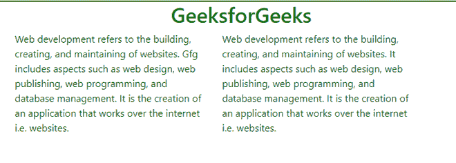

# 如何使用 jQuery 通过文本查找元素？

> 原文:[https://www . geeksforgeeks . org/如何使用-jquery/](https://www.geeksforgeeks.org/how-to-find-an-element-by-text-using-jquery/) 逐文本查找元素

我们将学习如何使用 jQuery 的 API 找到一个元素。本文需要一些 [HTML](https://www.geeksforgeeks.org/html-tutorials/) 、 [CSS](https://www.geeksforgeeks.org/css-tutorials/) 、 [JavaScript](https://www.geeksforgeeks.org/javascript-tutorial/) 、 [Bootstrap](https://www.geeksforgeeks.org/bootstrap-tutorials/) 和 [jQuery 的知识。](https://www.geeksforgeeks.org/jquery-tutorials/)可以根据元素是否包含我们要查找的字符串来选择元素。这可以通过使用包含选择器的 jQuery [来选择包含字符串的元素来完成。](https://www.geeksforgeeks.org/jquery-contains-selector/)

**关于包含选择器**

根据元素的不同，匹配的文本可以直接出现在选定元素的内部或子代内部。jQuery 中的 **:contains()** 选择器用于选择包含指定字符串的元素。文本必须有匹配的大小写才能被选择。

**语法:**要查找的文本字符串。它区分大小写。

```html
jQuery(":contains(text)")
```

**进场:**

*   在本地系统中创建一个 [HTML](https://www.geeksforgeeks.org/html-basics/) 文件“*index . HTML”*。
*   遵循[基本 HTML](https://www.geeksforgeeks.org/html-basics/) 模板和两段式，在 [< p >](://www.geeksforgeeks.org/html-paragraph/) 标签内添加文本。
*   用包含选择器的[选择

    标签，并在包含](https://www.geeksforgeeks.org/jquery-contains-selector/) 选择器方法的[中传递您想要选择作为参数的关键字。](https://www.geeksforgeeks.org/jquery-contains-selector/)
*   成功完成上述步骤后，将 CSS 属性附加到所选段落，该段落包含您在*包含*方法中作为参数传递的关键字。

**示例:**在本例中，我们正在寻找包含单词“Gfg”的元素。在选择元素后，我们改变包含单词“Gfg”的特定段落的颜色。

## 超文本标记语言

```html
<!DOCTYPE html>
<html>

<head>
    <link href=
"https://cdn.jsdelivr.net/npm/bootstrap@5.0.2/dist/css/bootstrap.min.css"
        rel="stylesheet" integrity=
"sha384-EVSTQN3/azprG1Anm3QDgpJLIm9Nao0Yz1ztcQTwFspd3yD65VohhpuuCOmLASjC"
        crossorigin="anonymous">

    <script src=
"https://cdnjs.cloudflare.com/ajax/libs/jquery/3.6.0/jquery.min.js">
    </script>

    <style>
        body {
            border: 2px solid green;
            min-height: 240px;
        }

        .center {
            display: flex;
            justify-content: center;
        }

        h1 {
            color: green;
            text-align: center;
        }
    </style>
</head>

<body>
    <h1>GeeksforGeeks</h1>

    <div class="row container">
        <div class="col">
            <p>
                Web development refers to the building, 
                creating, and maintaining of websites.
                Gfg includes aspects such as web design,
                web publishing, web programming, and 
                database management. It is the creation 
                of an application that works over the 
                internet i.e. websites.
            </p>
        </div>

        <div class="col">
            <p>
                Web development refers to the building, 
                creating, and maintaining of websites.
                It includes aspects such as web design, 
                web publishing, web programming, and 
                database management. It is the creation 
                of an application that works over the 
                internet i.e. websites.
            </p>
        </div>
    </div>

    <script>
        $('p:contains("Gfg")').css({ 'color': 'green' });
    </script>
</body>

</html>
```

**输出:**



包含文本