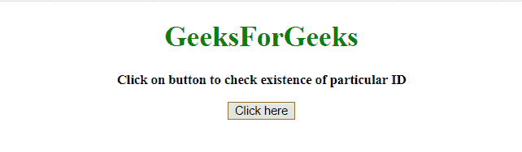
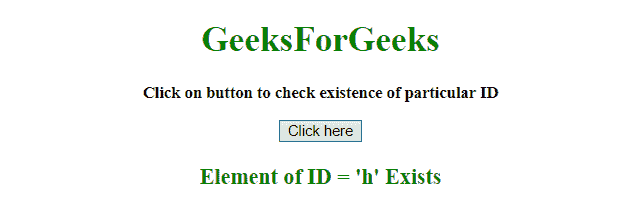
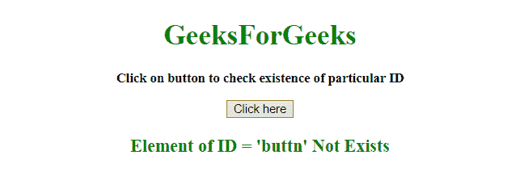

# 如何使用 jQuery 查找特定 ID 的元素？

> 原文:[https://www . geesforgeks . org/how-to-find-element-with-specific-id-use-jquery/](https://www.geeksforgeeks.org/how-to-find-element-with-specific-id-using-jquery/)

问题是使用 JQuery 确定具有特定 id 的元素是否存在。

*   **jQuery on()方法:**此方法为所选元素和子元素添加一个或多个事件处理程序。
    **语法:**

```
$(selector).on(event, childSelector, data, function, map)
```

*   **参数:**
    *   **事件:**必选参数。它指定一个或多个要附加到选定元素的事件或命名空间。如果有多个事件值，这些值用空格隔开。事件必须是有效的。
    *   **儿童选择器:**为可选参数。它指定事件处理程序应该只附加到已定义的子元素。
    *   **数据:**为可选参数。它指定要传递给函数的附加数据。
    *   **功能:**必选参数。它指定事件发生时要运行的函数。
    *   **映射:**它指定了一个事件映射({event:func()，event:func()，…})，该事件映射有一个或多个要添加到所选元素的事件，以及事件发生时要运行的函数。

*   **jQuery 长度属性:**长度属性用于统计 jQuery 对象的元素个数。
    **语法:**

```
$(selector).length
```

**例 1:** 在本例中，var 名称包含要检查的 ID 名称。首先 JQuery 选择器通过 var 名称检查 ID，然后使用**长度属性**验证是否选择了某个东西。

## 超文本标记语言

```
<!DOCTYPE HTML>
<html>
    <head>
        <title>
            How to find element with
            specific id exists or not
        </title>

        <script src =
"https://ajax.googleapis.com/ajax/libs/jquery/3.4.0/jquery.min.js">
        </script>
    </head>

    <body style = "text-align:center;">

        <h1 id = "h" style = "color:green;" >
            GeeksForGeeks
        </h1>

        <p id = "GFG_UP" style =
            "font-size: 15px; font-weight: bold;">
        </p>

        <button id = "button">
            Click here
        </button>

        <p id = "GFG_DOWN" style =
            "color:green; font-size: 20px; font-weight: bold;">
        </p>

        <script>
            $('#GFG_UP').
                text("Click on button to check existence of particular ID");

            var name = "h";
            $("button").on('click', function() {

                var exist = "";

                if($("#" + name).length == 0) {
                    exist = "Not Exists";
                }
                else {
                    exist = "Exists";
                }

                $('#GFG_DOWN').text("Element of ID = '"
                        + name + "' " + exist);

            });

        </script>
    </body>
</html>                   
```

**输出:**

*   **点击按钮前:**



*   **点击按钮后:**



**示例 2:** 在本例中，要检查的 ID 名称直接在 JQuery 选择器中传递。首先 JQuery 选择器检查 ID，然后**长度属性**用于验证是否选择了某个东西。

## 超文本标记语言

```
<!DOCTYPE HTML>
<html>
    <head>
        <title>
            How to find element with
            specific id exist or not
        </title>

        <script src =
"https://ajax.googleapis.com/ajax/libs/jquery/3.4.0/jquery.min.js">
        </script>
    </head>

    <body style = "text-align:center;">

        <h1 id = "h" style = "color:green;" >
            GeeksForGeeks
        </h1>

        <p id = "GFG_UP" style =
            "font-size: 15px; font-weight: bold;">
        </p>

        <button id = "button">
            Click here
        </button>

        <p id = "GFG_DOWN" style =
            "color:green; font-size: 20px; font-weight: bold;">
        </p>

        <script>
            $('#GFG_UP').
                text("Click on button to check existence of particular ID");

            $("button").on('click', function() {

                var exist = "";

                if($("#button").length == 0) {
                    exist = "Not Exists";
                }
                else {
                    exist = "Exists";
                }

                $('#GFG_DOWN').text("Element of ID = 'button"
                        + "' " + exist);
            });
        </script>
    </body>
</html>                   
```

**输出:**

*   **点击按钮前:**


*   **点击按钮后:**

