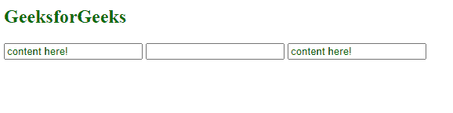

# 如何使用 jQuery 查找属性名以特定字母或文本开头的输入？

> 原文:[https://www . geesforgeks . org/how-find-inputs-with-attribute-name-以特定字母或文本开头-使用-jquery/](https://www.geeksforgeeks.org/how-to-find-inputs-with-an-attribute-name-starting-with-specific-letter-or-text-using-jquery/)

在本文中，我们将学习查找以特定字母或文本开头的属性名的输入。该任务使用*属性开始与*选择器实现。

**[属性开始于选择器](https://www.geeksforgeeks.org/jquery-attributevalue-selector-6/) :** 该选择器选择具有指定属性的元素，该属性的值正好从给定的字符串开始。它有两个参数，即属性和值。

**语法:**

```html
jQuery( "[attribute^='value']" )
```

*   **属性:**属性的名称。
*   **值:**属性的值(标识符或引用的刺痛)。

*属性开始于*选择器可用于识别由服务器端框架生成的页面中的元素，这些框架生成具有系统元素标识的 HTML。

**示例:**查找属性名以“GFG”开头的所有输入，并将文本放入其中。

## 超文本标记语言

```html
<!doctype html>
<html lang="en">
<head>
  <meta charset="utf-8">
  <script src=
"https://code.jquery.com/jquery-3.5.0.js">
  </script>
</head>
<body>
  <h2 style="color:green">GeeksforGeeks</h2>
  <input name="GFGletter">
  <input name="input2">
  <input name="GFGtext">

<script>
$( "input[name^='GFG']" ).val( "content here!" );
</script>

</body>
</html>
```

**输出:**



属性值