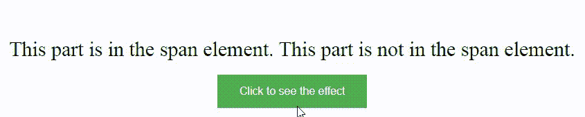

# 如何在段落内部找到 span 元素，并在 jQuery 中还原选择？

> 原文:[https://www . geeksforgeeks . org/如何在 jquery 中找到跨段元素并还原所选内容/](https://www.geeksforgeeks.org/how-to-find-span-elements-inside-paragraph-and-reverts-the-selection-back-in-jquery/)

本文的目的是找到段落内部的跨度元素，并使用 [Jquery](https://www.geeksforgeeks.org/jquery-tutorials/) 将选择还原。简单地说，我们只需要找到 span 元素。选择跨度元素后，我们必须结束最近的操作，即选择跨度元素，然后应用一些 [CSS](https://www.geeksforgeeks.org/css-tutorials/) 样式来显示恢复选择操作成功完成。

**进场:**

*   用段落元素中的[跨](https://www.geeksforgeeks.org/span-tag-html/)元素创建 HTML 页面。
*   使用。find()方法查找所有的 span 元素。
*   现在回到寻找跨度元素的操作。
*   最后应用一些 CSS 来显示操作已经被还原。

**使用的方法:**

1.  。 **Find()方法:**该方法用于返回所选元素的后代元素。
2.  。 **end()方法:**此方法用于恢复最近的破坏性操作，将匹配元素集更改为破坏性操作之前的状态
3.  。 [**css()方法**](https://www.geeksforgeeks.org/jquery-css-method/#:~:text=The%20css()%20method%20in,be%20used%20in%20different%20ways.&text=Return%20value%3A%20It%20wil%20return,property%20for%20the%20selected%20element.) **:** 此方法用于设置或返回所选元素的一个或多个样式属性。

**示例:**

## 超文本标记语言

```
<!DOCTYPE html>
<html>
  <head>
    <script src=
"https://code.jquery.com/jquery-git.js"></script>
    <meta charset="utf-8" />
    <meta name="viewport" 
          content="width=device-width" />
    <style>
      body {
        text-align: center;
        font-size: 30px;
      }
      p {
        margin: 10px;
        padding: 10px;
      }
      button {
        background-color: #4caf50; /* Green */
        border: none;
        color: white;
        padding: 15px 32px;
        text-align: center;
        text-decoration: none;
        display: inline-block;
        font-size: 16px;
      }
    </style>
  </head>
  <body>
    <h1 style="color: green">GeeksForGeeks</h1>

    <p>
      <span>This part is in the span element.</span> 
       This part is not in the
      span element.
    </p>

    <button>Click to see the effect</button>
    <script>
      $("button").click(function () {
        $("p").find("span").end()
              .css("background-color", "lightgreen");
      });
    </script>
  </body>
</html>
```

**输出:**



**说明:**第一个操作是在段落元素内找到 span 元素。第二个操作是恢复选择操作。之后，CSS 样式不是在 span 元素上完成的，而是在整个段落元素上完成的。