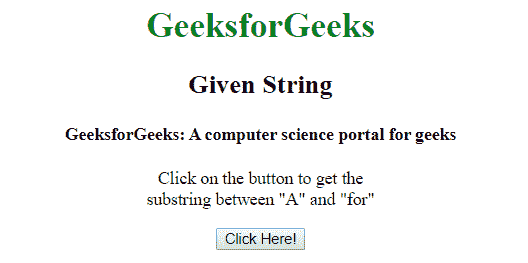
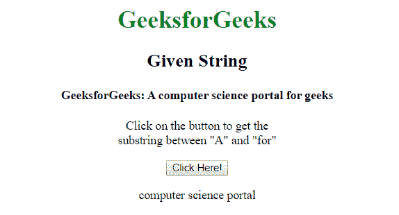

# 如何用 jQuery 找到两个词之间的子串？

> 原文:[https://www . geeksforgeeks . org/如何使用-jquery/](https://www.geeksforgeeks.org/how-to-find-sub-string-between-the-two-words-using-jquery/) 查找两个单词之间的子字符串

给定一个包含单词的字符串，任务是使用 jQuery 找到两个给定单词之间的子字符串。有两种方法可以解决这个问题，讨论如下:

**使用 match()方法:**它在字符串中搜索与任何正则表达式的匹配，如果找到匹配，则以数组形式返回匹配字符串。

**语法:**

```html
string.match( *regexp* )
```

**进场:**

*   从 HTML 元素中获取字符串。
*   以“starting_word(”这样的格式提供正则表达式。*)ending_word”。
*   将提取起始词和结束词之间的子字符串。

**示例:**

```html
<!DOCTYPE html>
<html>

<head>
    <title>
        How to find substring between
        the two words using jQuery ?
    </title>

    <script src=
"https://code.jquery.com/jquery-1.12.4.min.js">
    </script>
</head>

<body style = "text-align:center;">

    <h1 style = "color:green;" > 
        GeeksforGeeks 
    </h1> 

    <h2>Given String</h2>

    <h4>
        GeeksforGeeks: A computer
        science portal for geeks
    </h4>

    <p>
        Click on the button to get the<br> 
        substring between "A" and "for"
    </p>

    <button onclick=myGeeks()>
        Click Here!
    </button>

    <p id="GFG"></p>

    <script>
        function myGeeks() {
            $(document).ready(function() {
                $("button").click(function() {
                    var str = "GeeksforGeeks: A computer"
                           + " science portal for geeks";

                    var subStr = str.match("A(.*)for");

                    document.getElementById('GFG').innerHTML
                                = subStr[1];
                });
            });
        }
    </script>
</body>
</html>
```

**输出:**

*   **之前点击按钮:**
    *   **After Click on button:**
    

    **使用 split()方法:**它只是通过指定的字符或字符串将一个字符串拆分为一个子字符串数组，并返回新的数组。

    **语法:**

    ```html
    string.split( *separator*, *limit* )
    ```

    **进场:**

    *   从 HTML 元素中获取一个字符串。
    *   根据 starting _ word 和 end _ word 将字符串拆分为子字符串。
    *   将提取起始词和结束词之间的子字符串。

    **示例:**

    ```html
    <!DOCTYPE html>
    <html>

    <head>
        <title>
            How to find substring between
            the two words using jQuery ?
        </title>

        <script src=
    "https://code.jquery.com/jquery-1.12.4.min.js">
        </script>
    </head>

    <body style = "text-align:center;">

        <h1 style = "color:green;" > 
            GeeksforGeeks 
        </h1> 

        <h2>Given String</h2>

        <h4>
            GeeksforGeeks: A computer
            science portal for geeks
        </h4>

        <p>
            Click on the button to get the<br> 
            substring between "A" and "for"
        </p>

        <button onclick=myGeeks()>
            Click Here!
        </button>

        <p id="GFG"></p>

        <script>
            function myGeeks() {
                $(document).ready(function() {
                    $("button").click(function() {
                        var str = "GeeksforGeeks: A computer"
                               + " science portal for geeks";

                        var subStr = 
                            str.split('A').pop().split('for')[0];

                        document.getElementById('GFG').innerHTML
                                    = subStr;
                    });
                });
            }
        </script>
    </body>
    </html>         
    ```

    **输出:**

    *   **之前点击按钮:**
    *   **点击按钮后:**
    