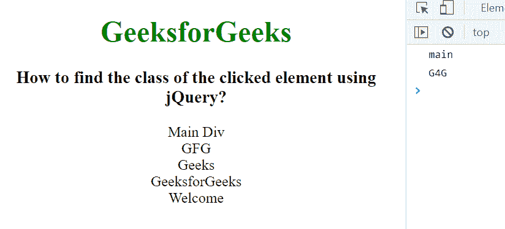

# 如何用 jQuery 找到被点击元素的类？

> 原文:[https://www . geeksforgeeks . org/如何使用-jquery/](https://www.geeksforgeeks.org/how-to-find-the-class-of-clicked-element-using-jquery/) 查找被点击元素的类别

在本文中，我们将使用 jQuery 找到被点击元素的类。为了找到被点击元素的类，我们使用这个. className 属性。className 属性用于设置或返回元素的类属性的值。使用此属性，用户可以将元素的类更改为所需的类。

**进场:**

这里，我们使用这个. className 属性来获取当前 div 元素的类名。在这里，我们添加了五个具有不同类名的 div 元素，然后使用 jQuery this.className 属性获取被单击的 div 元素类名，并将其显示在控制台上。

**语法:**

```html
$("div").click(function () {
    var getClass = this.className;
    console.log(getClass);
});
```

**示例:**

## 超文本标记语言

```html
<!DOCTYPE html>
<html lang="en">

<head>
    <title>
        How to find the class of the 
        clicked element using jquery?
    </title>

    <!-- Import jQuery cdn library -->
    <script src=
"https://ajax.googleapis.com/ajax/libs/jquery/3.3.1/jquery.min.js">
    </script>

    <script>
        $(document).ready(function () {
            $("div").click(function () {
                var getClass = this.className;
                console.log(getClass);
            });
        });
    </script>
</head>

<body style="text-align: center;">
    <h1 style="color: green;">
        GeeksforGeeks
    </h1>

    <h3>
        How to find the class of the 
        clicked element using jquery?
    </h3>

    <div class="main">Main Div</div>
    <div class="GFG">GFG</div>
    <div class="Geeks">Geeks</div>
    <div class="G4G">GeeksforGeeks</div>
    <div class="welcome">Welcome</div>
</body>

</html>
```

**输出:**

