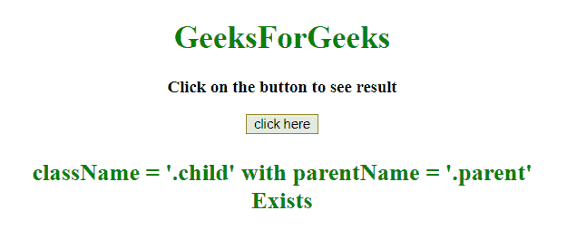

# 如何在 jQuery 中找到类已知的父类名？

> 原文:[https://www . geeksforgeeks . org/如何用 jquery 中的已知类查找父类名称/](https://www.geeksforgeeks.org/how-to-find-the-parent-class-name-with-known-class-in-jquery/)

给定一个 HTML 文档，任务是在给定类名的帮助下获取元素的父类。

**方法 1:**

*   方法上的[用于选择所选元素的事件处理程序。这意味着当用户点击按钮，然后函数调用。](https://www.geeksforgeeks.org/jquery-on-with-examples/)
*   [最近()方法](https://www.geeksforgeeks.org/jquery-closest-with-examples/)用于返回所选元素的第一个祖先。
*   检查祖先(父)类是否存在，然后返回类名，否则返回不存在。

**示例:**本示例使用**最近()方法**获取元素的第一个匹配祖先。

```
<!DOCTYPE html>
<html>

<head>
    <title>
        How to find a parent class
        name with a known class
    </title>

    <script src=
"https://ajax.googleapis.com/ajax/libs/jquery/3.4.0/jquery.min.js">
    </script>
</head>

<body style="text-align:center;">

    <h1 style="color:green;"> 
        GeeksForGeeks 
    </h1>

    <p id="GFG_UP" style=
        "font-size: 17px; font-weight: bold;">
    </p>

    <div class="parent">
        <div class="child"></div>
    </div>

    <button>
        click here
    </button>

    <p id="GFG_DOWN" style=
        "color: green; font-size: 24px; font-weight: bold;">
    </p>

    <script>
        $('#GFG_UP').text('Click on the button to see result');
        $('button').on('click', function() {
            var object = $('.child').closest('.parent');

            if (object.length) {
                $('#GFG_DOWN').text("className = '.child'"
                    + " with parentName = '.parent'" + " Exists");
            } 
            else {
                $('#GFG_DOWN').text("Not Exists");
            }
        });
    </script>
</body>

</html>
```

**输出:**

*   **点击按钮前:**
    
*   **点击按钮后:**
    

**方法 2:**

*   on()方法用于为选定的元素选择事件处理程序。这意味着当用户点击按钮，然后函数调用。
*   parent()方法用于返回所选元素的所有祖先。
*   检查祖先(父)类是否存在，然后返回类名，否则返回不存在。

**示例:**本示例使用 **parents()方法**获取元素的所有匹配祖先。

```
<!DOCTYPE html>
<html>

<head>
    <title>
        How to find a parent class
        name with a known class
    </title>

    <script src=
"https://ajax.googleapis.com/ajax/libs/jquery/3.4.0/jquery.min.js">
    </script>
</head>

<body style="text-align:center;">

    <h1 style="color:green;"> 
        GeeksForGeeks 
    </h1>

    <p id="GFG_UP" style=
        "font-size: 17px; font-weight: bold;">
    </p>

    <div class="parent">
        <div class="child"></div>
    </div>

    <button>
        click here
    </button>

    <p id="GFG_DOWN" style=
        "color: green; font-size: 24px; font-weight: bold;">
    </p>

    <script>
        $('#GFG_UP').text('Click on the button to see result');
        $('button').on('click', function() {
            var object = $('.child').parents('.parent');

            if (object.length) {
                $('#GFG_DOWN').text("className = '.child'"
                    + " with parentName = '.parent'" + " Exists");
            }
            else {
                $('#GFG_DOWN').text("Not Exists");
            }
        });
    </script>
</body>

</html>
```

**输出:**

*   **点击按钮前:**
    
*   **点击按钮后:**
    

jQuery 是一个开源的 JavaScript 库，它简化了 HTML/CSS 文档之间的交互，它以其“少写多做”的理念而闻名。
跟随本 [jQuery 教程](https://www.geeksforgeeks.org/jquery-tutorials/)和 [jQuery 示例](https://www.geeksforgeeks.org/jquery-examples/)可以从头开始学习 jQuery。