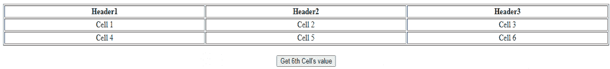
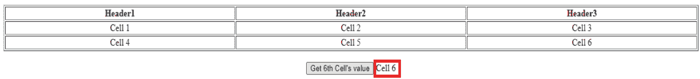

# 如何在 jQuery 中找到 3×3 表格的第六个单元格(第二行第三列)？

> 原文:[https://www . geeksforgeeks . org/如何在 jquery 中找到第六个单元格的第二行第三列表/](https://www.geeksforgeeks.org/how-to-find-the-sixth-cell-second-row-and-third-column-of-a-3x3-table-in-jquery/)

在本文中，我们将看到如何在 jQuery 中获取 3×3 表的第六个单元格。要找到一个元素的第 n 个子元素，我们可以使用 jQuery 的[第 n 个子选择器](https://www.geeksforgeeks.org/jquery-nth-child-selector/)。

**方法:**使用以下 jQuery 调用可以找到 3×3 表的第六个单元格:

```
$('#table1 tr:nth-child(2) td:nth-child(3)').text();
```

如果表有列标题，可以使用下面的调用找到第六个单元格。

```
$('#table1 tr:nth-child(3) td:nth-child(3)').text();
```

**HTML 代码:**请注意，第 n 个子选择器的索引是基于 1 的。

## 超文本标记语言

```
<!DOCTYPE html>
<html>

<head>
    <script type="text/javascript" src=
"https://code.jquery.com/jquery-3.6.0.min.js">
    </script>

    <script type="text/javascript">
        $(document).ready(function () {
            $('#btnGetValue').click(function () {
                $('#value').text($(
'#table1 tr:nth-child(3) td:nth-child(3)').text());
            });
        });
    </script>
</head>

<body style="text-align:center">
    <table id="table1" style=
        "width:100%" border="1">
        <tr>
            <th>
                Header1
            </th>
            <th>
                Header2
            </th>
            <th>
                Header3
            </th>
        </tr>
        <tr>
            <td>Cell 1</td>
            <td>Cell 2</td>
            <td>Cell 3</td>
        </tr>
        <tr>
            <td>Cell 4</td>
            <td>Cell 5</td>
            <td>Cell 6</td>
        </tr>
    </table>
    <br>

    <input type="button" 
        value="Get 6th Cell's value" 
        id="btnGetValue" />

    <span id="value"></span>
</body>

</html>
```

**输出:**我们看到下面的网页。

*   **点击前:**



*   **点击后:**

您会看到按钮旁边的第六个单元格的值(用红色矩形突出显示)



点击输出后