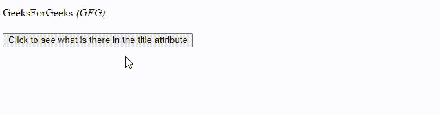
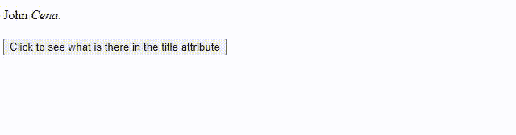

# 如何用 jQuery 找到页面中第一个强调元素的标题属性？

> 原文:[https://www . geesforgeks . org/如何使用-jquery/](https://www.geeksforgeeks.org/how-to-find-the-title-attribute-of-the-first-emphasized-element-in-the-page-using-jquery/) 找到页面中第一个强调元素的标题属性

在 JavaScript 中，我们有很多不同的库，用于不同的目的。jQuery 也是 JavaScript 库的一部分，它是为了简化 JavaScript 代码而制作的，你可以做动画，让你的网站更有创意，也更动态。

在学习 jQuery 库之前，您必须对 HTML、CSS 和 JavaScript 有一个基本的了解。

在本文中，我们将看到如何使用 jQuery 找到页面上第一个强调的标题属性。*标题*是一个属性，而不是头部元素的一部分。*强调*是一个元素，用来赋予文本更多的重要性。

**使用的方法/功能–**

*   [**。点击()**](https://www.geeksforgeeks.org/jquery-click-with-examples/) **:** 当点击事件发生时，此方法触发*点击*事件运行。
*   [**。attr()**](https://www.geeksforgeeks.org/jquery-attr-method/) **:** 用于获取匹配元素集中第一个元素的属性值。
*   [**。text()**](https://www.geeksforgeeks.org/jquery-text-method/) **:用于获取匹配元素集合中每个元素的组合文本内容，包括其后代。**

**示例 1:** 首先在下面的示例中，我们会找到*强调的*元素，点击按钮后打印标题值。

## 超文本标记语言

```
<!DOCTYPE html>
<html>
  <head>
    <script src=
"https://code.jquery.com/jquery-git.js"></script>
    <meta charset="utf-8" />
    <meta name="viewport" content="width=device-width" />
    <style type="text/css">
      button {
        display: block;
        margin: 20px 0 0 0;
      }
    </style>
  </head>
  <body>
    <p>
      GeeksForGeeks
      <em title="is a computer science portal for geeks.">
       (GFG)
      </em>.
    </p>

    <p id="id1"></p>

    <button id="button1">
      Click to see what is there in the title attribute
    </button>
    <script>
      $("#button1").click(function () {
        var title = $("em").attr("title");
        $("#id1").text(title);
      });
    </script>
  </body>
</html>
```

**输出:**段落中出现的文本和*强调的*元素显示出来，后面跟着按钮。点击按钮后，您可以看到*标题*属性中的文本(值)。



**例 2:**

## 超文本标记语言

```
<!DOCTYPE html>
<html>
  <head>
    <script src="https://code.jquery.com/jquery-git.js"></script>
    <meta charset="utf-8" />
    <meta name="viewport" content="width=device-width" />
    <style type="text/css">
      button {
        display: block;
        margin: 20px 0 0 0;
      }
    </style>
  </head>
  <body>
    <p>John <em title="You Can't see me">Cena</em>.</p>

    <p id="id1"></p>

    <button id="button1">
      Click to see what is there in the title attribute
    </button>
    <script>
      $("#button1").click(function () {
        var title = $("em").attr("title");
        $("#id1").text(title);
      });
    </script>
  </body>
</html>
```

**输出:**

**点击前:**

