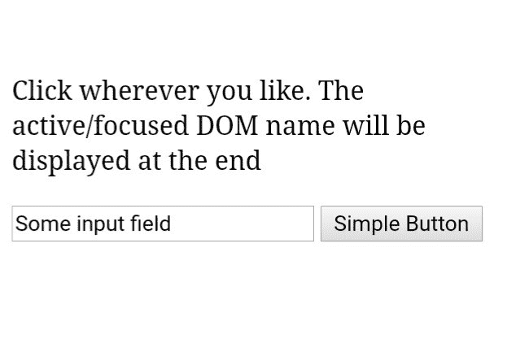
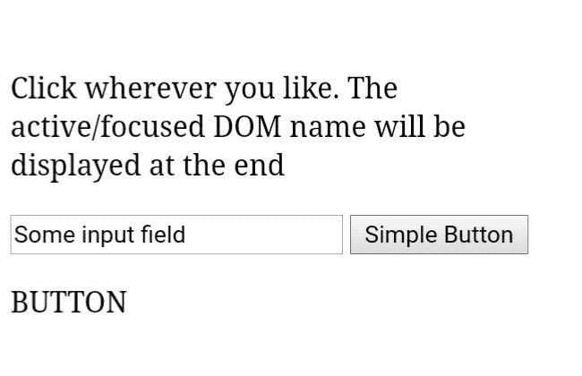
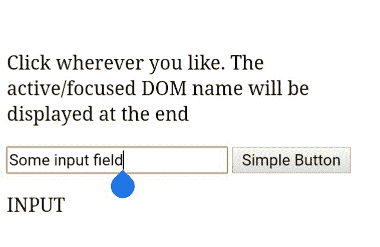

# 如何使用 jQuery 找到哪个 DOM 元素有焦点？

> 原文:[https://www . geeksforgeeks . org/如何使用-jquery/](https://www.geeksforgeeks.org/how-to-find-which-dom-element-has-the-focus-using-jquery/) 查找哪个 dom 元素具有焦点

超文本标记语言 DOM 有一个**活动元素**属性。它可用于获取文档中当前聚焦的元素:

```
Syntax: var ele = document.activeElement;

```

**返回值:**返回文档中当前聚焦的元素。
**示例代码片段:**

```
Example 1: var eleName = document.activeElement.tagName;
Returns: The Tag Name of the active element.

Example 2: var eleId = document.activeElement.id;
Returns: The id of the active element, if any.

```

**演示工作的示例代码:**

```
<!DOCTYPE html>
<html>
  <head>
    <script src=
"https://ajax.googleapis.com/ajax/libs/jquery/3.3.1/jquery.min.js">
    </script>
  </head>
  <body>

    <p> Click wherever you like. 
The active/focused DOM name will be displayed at the end</p>
    <input type="text" value="Some input field">
    <button>Simple Button</button>

    <p id="fun"></p>

    <script>
      $("body").click(function() {
        var x = document.activeElement.tagName;
        document.getElementById("fun").innerHTML = x;
});
    </script>

  </body>
</html>
```

**以上代码的解释:**
*脚本*内部主体标签将 id 为 *fun* 的 DOM 元素的 HTML Content 修改为当前活动或焦点所在的 DOM 元素的名称。这是由

```
document.activeElement.tagName
```

**输出:**

1.  **点击/聚焦前:**
    
2.  **点击/聚焦后:**
    
3.  点击/聚焦输入字段时
    