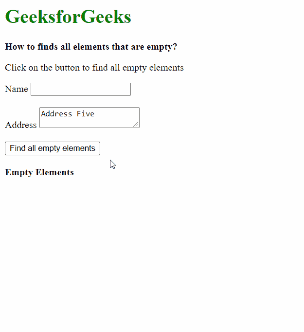
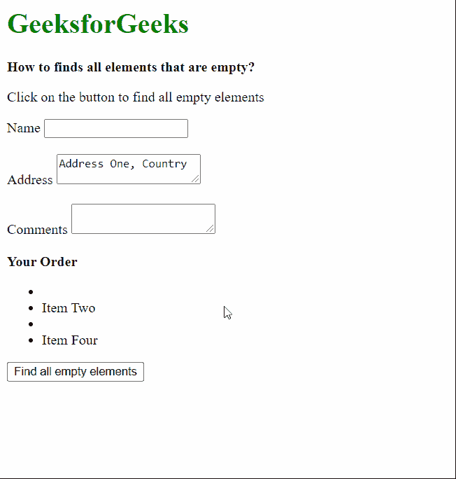

# 如何查找 jQuery 中所有为空的元素？

> 原文:[https://www . geesforgeks . org/how-to-find-all-in-empty-in-jquery/](https://www.geeksforgeeks.org/how-to-finds-all-elements-that-are-empty-in-jquery/)

在本文中，我们将看到如何使用 jQuery 查找页面上所有为空的元素。

**方法 1:****:空**选择器可用于获取页面中当前为空的所有元素。使用 **each()** 方法迭代这些元素，并且可以使用循环中的*这个*引用来访问这些元素。

可以通过在禁用的选择器前面指定元素的类型来选择特定类型的元素，否则将选择页面上的所有元素。例如，我们可以指定只有*输入*和*文本区*元素为空时才需要检查。

**语法:**

```
$(".btn").on("click", function () {

    // Select all the empty elements on
    // the page and iterate through them
    $(":empty").each(function () {

        // Access the empty elements
    });
});
```

以下示例说明了上述方法:

**示例:**

## 超文本标记语言

```
<!DOCTYPE html>
<html>

<head>
    <script src=
"https://code.jquery.com/jquery-3.3.1.min.js">
    </script>
</head>

<body>
    <h1 style="color: green">
        GeeksforGeeks
    </h1>

    <b>
        How to finds all elements
        that are empty?
    </b>

    <p>
        Click on the button to find
        all empty elements
    </p>

    <label for="name">Name</label>
    <input type="text" name="name" id="name">
    <br><br>

    <label for="address">Address</label>
    <textarea name="address">
        Address Five
    </textarea>
    <br><br>

    <button class="btn">
        Find all empty elements
    </button>
    <br><br>

    <b>Empty Elements</b>
    <ul class="empty-elements"></ul>

    <script>
        $(".btn").on("click", function () {

            let empty_elems = [];

            // Select all the empty elements on
            // the page and iterate through them
            $(":empty").each(function (index) {

                // Add a border to the empty elements
                $(this).css(
                    "border", "2px red dotted"
                );

                // Add the elements to the list
                empty_elems += "<li>" + 
                    ($(this).get(0).tagName) + "</li>";
            });

            $(".empty-elements").html(empty_elems);
        });
    </script>
</body>

</html>
```

**输出:**



**方法 2:** 首先使用 jQuery 选择器选择页面中所有需要检查的元素。我们只能指定*输入*和*文本区*元素，如果它们为空，则应进行检查。然后这些元素循环通过，然后使用 **is()** 方法检查当前元素是否与选择器匹配。**:空**选择器用于检查是否为空，类似于第一种方法。

**语法:**

```
$(".btn").on("click", function () {

    // Select all the elements that
    // have to be checked and iterate
    // through them
    $("li, input, textarea").each(function () {

        // Check if the element is empty
        if ($(this).is(":empty"))
            // Access the empty element
        else
            // Access the non-empty element
    })
});
```

以下示例说明了上述方法:

**示例:**

## 超文本标记语言

```
<!DOCTYPE html>
<html>

<head>
    <script src=
"https://code.jquery.com/jquery-3.3.1.min.js">
    </script>
</head>

<body>
    <h1 style="color: green">
        GeeksforGeeks
    </h1>

    <b>
        How to finds all elements
        that are empty?
    </b>

    <p>
        Click on the button to find
        all empty elements
    </p>

    <label for="name">Name</label>
    <input type="text" name="name" id="name">
    <br><br>

    <label for="address">Address</label>
    <textarea name="address">
        Address One, Country
    </textarea>
    <br><br>

    <label for="address">Comments</label>
    <textarea name="address"></textarea>
    <br><br>

    <b>Your Order</b>
    <ul>
        <li></li>
        <li>Item Two</li>
        <li></li>
        <li>Item Four</li>
    </ul>

    <button class="btn">
        Find all empty elements
    </button>

    <script>
        $(".btn").on("click", function () {

            // Select all the elements that
            // have to be checked and iterate
            // through them
            $("li, input, textarea").each(function () {

                // Check if the element is empty
                // and apply a style accordingly
                if ($(this).is(":empty"))
                    $(this).css(
                        "border", "2px red dashed"
                    );
                else
                    $(this).css(
                        "border", "2px green solid"
                    );
            })
        });
    </script>
</body>

</html>
```

**输出:**

