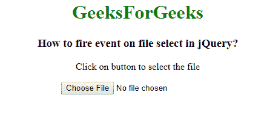

# 如何使用 jQuery 在文件选择上触发事件？

> 原文:[https://www . geeksforgeeks . org/如何使用 jquery 启动文件上的事件选择/](https://www.geeksforgeeks.org/how-to-fire-an-event-on-file-select-using-jquery/)

给定一个 HTML 文档和使用 jQuery 选择文件时触发事件的任务。 **JQuery change()方法**用于在选择文件时触发事件。

**使用[更改()方法](https://www.geeksforgeeks.org/jquery-change-with-examples/) :** 用于更改输入字段的值。这个方法适用于“输入、文本区域和选择”元素。

**语法:**

```
$(selector).change(function)
```

**例 1:** 选择文件时，使用 change()方法触发事件。

```
<!DOCTYPE html>
<html>

<head>
    <title>
        How to fire event on
        file select in jQuery?
    </title>

    <script src=
"https://code.jquery.com/jquery-1.12.4.min.js">
    </script>
</head>

<body style = "text-align:center;">

    <h1 style = "color:green;" > 
        GeeksForGeeks 
    </h1> 

    <h3>
        How to fire event on file
        select in jQuery?
    </h3>

    <p>Click on button to select the file</p>

    <input type="file" id="Geeks" value="Click">

    <script>
        $(document).ready(function() {
            $('input[type="file"]').change(function() {
                alert("A file has been selected.");
            });
        });
    </script>
</body>

</html>
```

**输出:**


**例 2:** 选择文件时，使用 change()方法触发事件。

```
<!DOCTYPE html>
<html>

<head>
    <title>
        How to fire event on
        file select in jQuery?
    </title>

    <script src=
"https://code.jquery.com/jquery-1.12.4.min.js">
    </script>
</head>

<body style = "text-align:center;">

    <h1 style = "color:green;" > 
        GeeksForGeeks 
    </h1> 

    <h3>How to fire event on file select in jQuery?</h3>

    <p>Click on button to select the file</p>

    <input type="file" id="Geeks" value="Click">

    <h4></h4>

    <script>
        $(document).ready(function(){
            $('input[type="file"]').change(function(){
                $("h4").text("File is added!");
            });
        });
    </script>
</body>

</html>
```

**输出:**
