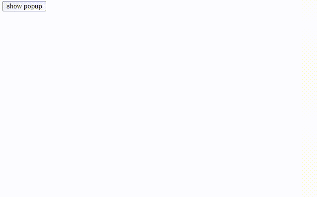

# 如何使用 jQuery 生成一个简单的弹出窗口？

> 原文:[https://www . geeksforgeeks . org/如何使用-jquery/](https://www.geeksforgeeks.org/how-to-generate-a-simple-popup-using-jquery/) 生成简单弹出菜单

任务是使用 jQuery 生成一个弹出窗口。弹出窗口有助于向网站访问者传播重要信息。

**方法:**使用 jQuery 的 [**toggle()** 方法](https://www.geeksforgeeks.org/jquery-toggle-method/)可以进行简单的弹出，该方法在 jQuery 的 [hide()](https://www.geeksforgeeks.org/jquery-hide-with-examples/) 和 [show()](https://www.geeksforgeeks.org/jquery-effect-show-method/) 功能之间切换，即检查所用选择器的可见性。选择器可见时运行 *hide()* 方法，选择器不可见时运行 *show()* 方法。

如果单击了“显示弹出窗口”按钮，则显示弹出窗口；如果单击了“关闭”按钮，则隐藏弹出窗口。

用于切换的选择器是**。内容"**"包含关闭按钮和弹出窗口的主体。最初为了隐藏页面重装时弹出的，我们使用了**显示:**上的无**属性。内容**类中的样式标签。

现在当用户点击显示弹出按钮时 *onclick 事件*调用显示弹出窗口的 *togglePopup()* ，当用户点击关闭按钮时 onclick 事件再次调用隐藏弹出窗口的 *togglePopup()* 。

#### 语法:

```html
$(selector).toggle();
```

#### 示例:

## 超文本标记语言

```html
<!DOCTYPE html>
<html>

<head>
    <!-- jQuery cdn link -->
    <script src=
        "https://code.jquery.com/jquery-3.5.1.min.js">
    </script>

    <style type="text/css">
        .content {
            position: absolute;
            top: 50%;
            left: 50%;
            transform: translate(-50%, -50%);
            width: 500px;
            height: 200px;
            text-align: center;
            background-color: #e8eae6;
            box-sizing: border-box;
            padding: 10px;
            z-index: 100;
            display: none;
            /*to hide popup initially*/
        }

        .close-btn {
            position: absolute;
            right: 20px;
            top: 15px;
            background-color: black;
            color: white;
            border-radius: 50%;
            padding: 4px;
        }
    </style>
</head>

<body>
    <button onclick="togglePopup()">show popup</button>

    <!-- div containing the popup -->
    <div class="content">
        <div onclick="togglePopup()" class="close-btn">
            ×
        </div>
        <h3>Popup</h3>

        <p>
            jQuery is an open source JavaScript library 
            that simplifies the interactions between an
            HTML/CSS document, or more precisely the 
            Document Object Model (DOM), and JavaScript.
            Elaborating the terms, jQuery simplifies 
            HTML document traversing and manipulation, 
            browser event handling, DOM animations, 
            Ajax interactions, and cross-browser 
            JavaScript development.
        </p>
    </div>

    <script type="text/javascript">

        // Function to show and hide the popup
        function togglePopup() {
            $(".content").toggle();
        }
    </script>
</body>

</html>
```

#### 输出:

