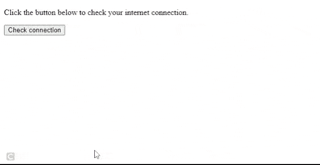
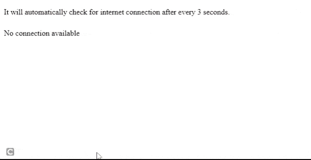

# 如果使用 jQuery 没有互联网连接，如何获得对话框？

> 原文:[https://www . geeksforgeeks . org/how-to-get-a-dialog-box-if-no-internet-connection-use-jquery/](https://www.geeksforgeeks.org/how-to-get-a-dialog-box-if-there-is-no-internet-connection-using-jquery/)

在本文中，我们将看到如何使用 jQuery 检查互联网连接。我们将使用**导航器。在线**将返回*真*如果有互联网连接，否则将返回*假*。

**语法:**

```
navigator.onLine
```

**返回:**

*   真:如果互联网连接可用。
*   错误:如果互联网连接不可用。

**示例 1:** 本示例将检查互联网连接是否可用，并在按钮点击时显示一个警告框。

## 超文本标记语言

```
<!DOCTYPE html>
<html>
  <head>
    <!--Including JQuery-->
    <script src=
"https://ajax.googleapis.com/ajax/libs/jquery/3.5.1/jquery.min.js"></script>
    <script>
      $(document).ready(function () {
        // Function to be called on button click
        $("button").click(function () {

          // Detecting the internet connection
          var online = navigator.onLine; 
          if (online) {

            // Showing alert when connection is available
            $("#message").show().html("Connected!");
          } else {

            // Showing alert when connection is not available
            alert("No connection available");
          }
        });
      });
    </script>
  </head>
  <body>
    <p>
      Click the button below to check 
      your internet connection.
    </p>

    <button>Check connection</button>
    <div style="height: 10px"></div>
    <div id="message"></div>
  </body>
</html>
```

**输出:**



检查连接

**示例 2** :本示例每 3 秒钟自动检查一次互联网连接。如果没有互联网连接，它将显示一个警报。

## 超文本标记语言

```
<!DOCTYPE html>
<html>
  <head>
    <!--Including JQuery-->
    <script src=
"https://ajax.googleapis.com/ajax/libs/jquery/3.5.1/jquery.min.js">
    </script>
    <script>

      // Function to check internet connection
      function checkInternetConnection() {

        // Detecting the internet connection
        var online = navigator.onLine;
        if (!online) {

          // Showing alert when connection is not available
          $("#message").show().html("No connection available");
        }
      }

      // Setting interval to 3 seconds
      setInterval(checkInternetConnection, 3000);
    </script>
  </head>
  <body>
    <p>
      It will automatically check for internet
      connection after every 3 seconds.
    </p>

    <div style="height: 10px"></div>
    <div id="message"></div>
  </body>
</html>
```

**输出:**



没有可用的连接